# CryENGINE2 渲染引擎剖析（转）

 * 转自：[https://www.cnblogs.com/Zephyroal/archive/2010/10/16/1852884.html][1]
 * [作者 napoleon314 的 blog][7]
 * [XMath - Modified DirectXMath for cross-platform compiling][8]


## 前言

这个帖可能在这儿发比较奇怪，不过我是一个信仰黑客精神的程序员，也非常支持 [KlayGE][2] 的研发，希望发一些我的原创资料，和作者，以及 [KlayGE][2] 的作用者交流，甚至有一些麻烦的问题，也希望作者可以解答，如果 [KlayGE][2] 的研发能够涉及到这些东西，那就最好了。

作为一个刚从业不久的引擎开发人员，为了能快速有效地提高自己引擎的渲染质量，使用了各种办法来解析 CryENGINE 的渲染手法。在此我将以专业的视角来与您分享我的经验和成果。如果您也是专业的图形程序员，希望与您一起讨论，解读这款令人惊叹的引擎，如果您是一个刚刚入门的新人或者爱好者，这将成为您不可多得的原创中文资料。

CryENGINE 是目前最难窥探的引擎没有之一，比起在中国泛滥的 UnrealEngine3 和 [Gamebryo][4] 的源代码，CryENGINE 也显得神秘得多，很少有人说自己有这款引擎，哪怕只有一个Eval。虽然有教育免费版，但是据我所知，也只有北大才申请到了授权。花了500W左右买了授权的好像也只有畅游和久游。但是越是如此，这款引擎的魅力越让人无法抗拒。当我有 [PerfHUD][3]、PIX 这样的分析工具时，我如何能不想着去拆解这个神秘又神奇的引擎呢。

Crysis 所伴随的往往是最高画质的赞美和硬件杀手的批评，但是，我觉得即使这样，CryENGINE 仍然可以称为当今世界上优化最好，负载最大的引擎。其实引擎的设计追求的主要是负载能力，追求画面的应该是游戏。但是反过来，拥有最大的画面质量，没有引擎的强大负载，肯定是做不到的。任何引擎可以被美术用成硬件杀手，但是能在同样的情况下，跑出 Crysis 那样的画面的引擎肯定有着强大的负载能力。

CryENGINE 优化的出彩之处主要有以下几个方面：

 * 材质排序：从 [PerfHUD][3] 的结果来看，CryENGINE 对 DXAPI 的调用是最为简洁的，如此多的材质，却只有如此简洁的状态切换过程，不能不令人赞叹，相比之下，[Ogre][5] 或者 [Gamebryo][4] 之类的三流引擎做得就要差得多。材质排序已经被做到了极至，从这里省下来的时间，成为了Crysis如此复杂的宏大场景的基础。

 * 技术选择：这是我最佩服Crytek的一点，如此多的次世代渲染技术，竟然每个都如此地和谐，兼顾着性能与效果。我研究了它的好多渲染手法，真是深有感触，为啥能如此恰当地选择技术呢？后来看了它们 LPV 的一篇 Paper 中有这样一个预算（下图）。这从恍然大悟。原来他们竟如此专业，预先做了这样的评估，难怪技术都被优化得如此高效，和谐。

 * 瑕疵优化：这个通常被人忽略，或者被人认为是错的。很多人都觉得宁愿速度慢一点，也要求技术没有瑕疵。其实，这是不对的。瑕不掩瑜，在 Crysis 如此震撼的效果面前，有几个会对它技术的瑕疵非常关注，觉得不能忍受呢？但是在 CryENGINE 中，所有的瑕疵都换来了宝贵的时间，以至它能对一个游戏添加如此多的渲染技术，以达到 Crysis 的效果。

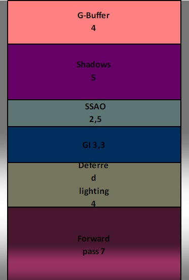

有了这些与众不同，使 CryENGINE 变得如此另类，以及怪物般的负载能力。当然有人要说，CryENGINE 不是最快的，因为相同速度的情况下，虚幻的画面可能更好。对，确实，虚幻的 Irradiance 技术提供了一个廉价的 GI 效果，但是，这个东西带来的限制却让虚幻完全没有能力大幅度改变场景光照，因为主光源是预先渲染好的。这个东西在 CryENGINE3 中已经被支持了，同时候还有了 LPV 这个神奇的动态 GI。这样说的话，Crysis 所追求的全动态场景的理念其实也是逼真临场体验的一部分，当然需要更多的性能开销了。也就是因为 Crysis 有昼夜变化，才带来了这种前所未有的临场体验。

接下来，我要对 Crysis 所使用的渲染技术进行一些细致的剖析，当然也带着一些不理解的问题，希望大牛们能给我一些建议和帮助。

Crysis 是用 CryENGINE2 制作的，CryENGINE3 无幸窥见，在这里，先说说确切的 CryENGINE2 的渲染过程。

众所周知 CryENGINE2，没有使用 DeferredShading，所以无法支持太多的光源，主要渲染围绕着阳光进行，而且使用了非常复杂的 PixelShader 来实现漂亮的材质，所以 ZPass 预渲染就变得很必要，不然会有很多无用像素被复杂的 PixelShader 渲染，当然这个和 DeferredShading 一样，无法支持 Blend，所以只有两种，普通和 AlphaTest。渲染 ZPass 为了开启 PreZ，肯定要进行排序，先渲染普通物体，后渲染带 AlphaTest（当然是使用 Shader 的 Texkill 来进行，没有状态切换）的物体。其实标准的 ZPass 应该是不需要 ColorWrite 的，但是 Crysis 利用这个机会，输出了深度到一张 R32F，因为视距为八公里，乘一个 0.000125 映射到 [0,1]，天空为2。有了深度的 G-Buffer，其实就已经可以做很多事了，除了光照外很多的后处理都可以用这张深度缓冲来进行。有了深度后，会先进行 AO 计算，然后阴影，这都是屏幕空间的计算，然后渲染每个物体都会对这两张图进行采样。AO 是一张 RGBA，R通道用来存 SSAO 的结果，G通道用来存 2.5D TerrainAO 的结果。然后进行一次 Blur。阴影是有个 Mask 的，平行光一般是R，剩下三个通道，大概可以存放三个点光源或者 SpotLight 吧。然后就是对一张 R16G16B16A16F 进行 HDR 的高范围渲染。这回 DepthFunc 已经是 Equal 了，因为深度已经完全填充。当然，为了 PreZ，还是先普通后 AlphaTest，然后会看到大量的碎片，因为Z检测会挡掉大量像素。所有着色像素加起来也几乎就是屏幕像素了，除非有两个三角形有点是同 Depth 的 Fighting 状态，当然可能性很低。完成后会进行 Blend 渲染，主要是粒子，玻璃之类的东西。结束后，就要进行 HDR ToneMap 和 HDR HighLightBloom 了。完成后，接下来有一个 EdgeAA，当然除此之外应该还有抗齿过程，只是调试时肯定是要关掉的。EdgeAA 是个抗齿的后处理，只使用 Depth 来提取边缘。然后还有个 Glow，大概会把火焰之类的 Bloom 加大吧。在这之后，就是 SunShaft，来加上漂亮的 Ray 和 Beam，最后会进行 ColorGrading，完成渲染的最后一步，这样，就能看到 Crysis 的画面了。这样说是不是有些笼统呢？没关系，如果大家喜欢，我还会继续深入剖析 CryENGINE 渲染的一些技术点，来解读震撼画面背后的故事。今天有点晚了先写到这儿了。

睡前再写一些看了 [KlayGE][2] 后的感想，[KlayGE][2] 是一款我很喜欢的开源引擎。对于开源引擎来说，没有强大的资金支持，很难开发出像商业引擎那样功能强大的实用引擎。[KlayGE][2] 这样研究一些新鲜的 API，支持 OGL3或4，DX11，以及一些好玩的技术的实现，却是真正有帮助的。它的字体算法的设计真的是非常的独到，让我非常震撼，我正在想有什么办法能使缩小时更清晰。像 [Ogre][5]、[Irrlicht][6] 那种引擎中既见不到强大的实用性，又没有这样的看点，我个人还是比较无爱的。[KlayGE][2] 最近又出了 FFT 的水，对于只能看到 SigGraph1999 的我来说，还是非常有帮助的，记得上回 [Ogre][5] 有个水体插件，也做了 FFT 的波动，不过实时 CPU 刷顶点做法还是有点过了，这了新的 Demo 看，真的挺兴奋的。

有一点想问下作者，你的 DeferredShading 为啥不支持 HW 的 AA 呢，而使用一个后处理来进行？DX10开始，MRT 不是已经可以 AA 了吗？难道还有什么障碍？

最后发张我现在自己渲染的图，虽然比 Crysis 差不少，但是渲染技术是差不多的。其实如果时间允许，我真是想自己操刀写个引擎，把 [Ogre][5] 改成这样真不是一般的麻烦，[Ogre][5] 的渲染体系太古典了，不太适应现代的技术，搞得我动不动接管过来调 DX，不然要么性能莫名其妙地不见，要么就是干脆无法实现。不过因为 DX9，使用了 DeferredShading 后只能用后处理来抗齿，其实可以用超级采样，但是舍不得那性能啊。[Ogre][5] 的材质系统不灵活，导致我一怒之下统一使用了线性过滤，材质糊糊的很不爽。下一步，可能就是要尝试下 LPV 了，毕竟 GI 还是很令人 Happy 的。


## Terrain

首先谈谈 CryENGINE 的地形技术。地形技术是 CryENGINE 的一个较为核心的技术，为了实现八公里的超远视距，地形经过了比较细致的优化。CryENGINE 的地形主要使用的数据结构仍然是高度图，并且在 CryENGINE2 中可以看到，它所支持的尺寸非常有限，好像也不是动态加载技术的无缝大场景。为此为特地下了 Crysis 的 Sandbox 一探究竟。CryENGINE 的地形 LOD 时并没有 Morph 的过渡而是直接突变，这让我很惊呀，一般地，地形 LOD 时的突变会非常刺眼以至于让人难以接受，但是在 Crysis 中，我却完全无法意识到这一点，反复摆弄它的场景后发现，原来是超高密度的植被覆盖使得地形的跳动完全被植被所遮挡，植被同样也在不停地突变，所以一般只能感觉到植被 LOD 时的突变，而无法感觉到地形 LOD 时的突变。因为不需要 Morph，CryENGINE 地形的灵活性就体现出来了，它可以切到最小只有 2M*2M 一个单元，但是越远，绘制的实际单元还是有所合并，具体 LOD 的细节仍然没有完全搞清楚，如果哪位大牛知道，希望能够不吝地告诉我，不胜感激啊。但是有一点是很清楚，它的 LOD 是有根据视觉复杂度和距离两个标准来决定网格精度的，我贴一张 Wireframe 先：


可以看到，网格精度并不是均匀地由近到远递减的，而是以地块视觉复杂度为权值的递减，期间有相当多的补面，以保证没有T型接缝。不过由于不需要 Morph，跨级 LOD 之间的补面变得相对容易。

除了 LOD 外，地表材质也是 CryENGINE 的一个比较出众的特性，Crysis 的地表材质细节之丰富，绝对是目前绝无仅有的，但是支持它使用如此多材质的地表细节技术，却是 CryENGINE 的一个特殊做法带来的。CryENGINE 并没有使用什么四层混合，而是按单层来划分的。当一层材质被刷到地形上的时候，CryENGINE 会生成一个材质的覆盖范围，也就是说每一个材质绘制时都有独立的IB区段，这样最大的好处是每个层都可以使用独立的渲染技术，而不会影响其它层，比如有 parallax 的地形层只有很少的一两个，但是混在其它层中却让地形细节有了整体的提升。还有就是因为地形距离有八公里，所以不可能都使用 Blend 的 Tiling 的v从x细节，在细节的几百米范围之外，就切换成只有一张的预生成大纹理，VirtualTexture 技术在这里得到了应用。在同时使用了 Tiling 和 VirtualTexture 的情况下，CryENGINE 的地形远近都有很好的细节表现，同时性能上也能够支撑起八公里的视距。

当然 CryENGINE 的地形技术中还有个神奇的 Voxel 技术。Voxel 其实是个很古老的概念，应用到地形中应该是三角洲的时候。不过那时的 Voxel 技术不是很适应现在的图形管线，CryENGINE 只是使用了 Voxel 作为一部分特殊地形的数据存储，最后用了某种算法，生成了与高度图 Terrain 无缝连接的 Mesh，使得悬崖、山洞可以在引擎中用 Terrain 实现。通常要做这些往往都使用模型，而不同的系统使用起来很容易产生接缝。这就是 Crysis 地貌如此丰富的原因。

不过 Voxel 的生成算法，我还没有想到，或者看到，很想知道有什么好办法来实现这个。不知道龚敏敏大大是否有这方面的办法，或者有见过关于这个的文献。如果 [KlayGE][2] 能整合一个类似的算法，那就最好了。

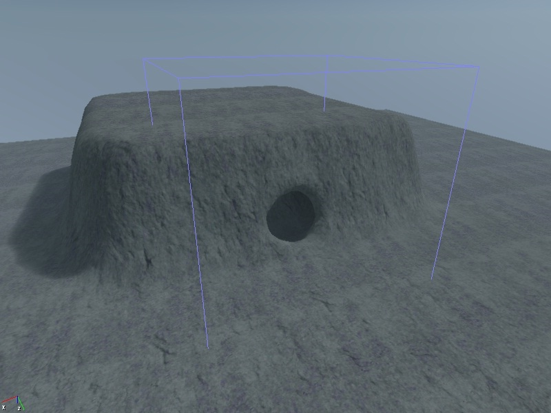

很希望看到 [KlayGE][2] 的 VirtualTexture 和 GI。目前我也正在整理一些解决方案，有这样的参考真的很不错哈。我可能考虑把 LightMass 和一种实时 GI 解决方案整合到无缝场景中。


## Shadows

CryENGINE 的阴影是我最喜欢的一个解决方案，它的科学性，实用性，让我很震撼。在目前的硬件条件下，CryENGINE 的阴影系统是一个比较完美的实时阴影解决方案。首先要说明的一点是，CryENGINE2 虽然不是 DeferredShading，但是仍然有深度图可用，所以可以在屏幕空间计算阴影，这样能为 PCF 节省非常多的采样，与 VSM 相比，采样次数会更少。这样就有了下面的结论：PCF 适用于实时性较高的阴影采样，因为一次采样的次数较少，而 VSM 更适用于低频更新的阴影，因为 VSM 可以预采样，采样完之后就能很快地生成阴影，这样的话，只要阴影不更新，VSM 就不需要再采样。有了以上的思想，就有了 CryENGINE 的阴影解决方案。首先用四张1024大的 D24S8 作为 PSSM 的四层，据我目测，PSSM 的距离大概在 200-300 之间，由于远处的物件通常是在较浓的雾里，所以，其实远处阴影对画面的增益会较弱，近的阴影距离让 CryENGINE 的四层1024图都获得了相当高的阴影清晰度。这四层阴影也并非实时更新，CryENGINE 对这阴影进行了控频，不过游戏中并未感觉到，只是 CryENGINE3 在GDC2009的那段视频中，很明显看到了控频的痕迹。VSM 则被用来渲染地形的阴影，众所周知，WOW的地形没有阴影，一开始我还以为这是对的，后来才发现原来WOW的光不会动，所以在阴影不被拉长的情况下，这样的阴影还是可以接受的，但是如果需要阳光动态变化，甚至拉到很长，没有阴影的地形会让物件的阴影腾空，相当难看，所以渲染地形的阴影还是有必要的。但是地形的阴影一般比较模糊，因为距离比较远，所以 PCF 对于地形来说，阴影边缘太过生硬，所以 CryENGINE 选择了用 VSM，在一张1024的 R16G16F 上渲染地形，然后进行一次 Blur，由于地形的阴影渲染范围很大，再加上地形静止不动，和光线变化较慢的特点，地形的阴影更新频率非常低，这样，地形阴影渲染的开销就会比较小。在渲染地形阴影的同时，CryENGINE 还加上了云阴影，使得阴影非常完整，逼真。VSM 使用半精度其实是非常冒险的，VSM 不像 PCF，利用统计学算法的 VSM 如果有完美的实数，将会是无比完美的，可惜，浮点的精度有限，想要 VSM 的阴影有一个模糊的边缘，高精度很必要。通常都使用32位的浮点，半精度会引起近处非常明显的条状失真。不过 CryENGINE 的这个失真仍然存在，只不过并不是很明显，主要原因有以下两点，

 * 第一，地形本身是个低频细节的模型，所以阴影距离通常都比较远，
 * 第二，CryENGINE 使用的阴影距离近，所以，本身深度范围都小，所以精度自然就会比较高，浮点数嘛。
 
所以 CryENGINE 很有效地利用 PCF 和 VSM 模拟出了非常高效完美的阴影。这个解决方案目前也被我一直在使用。

关于采样，一般，PCF 的采样是不如 VSM 的，原因是 PCF 是一个比较出来的二值结果，无法利用 MipMap，线性采样和 AA 之类的预采样，这也正是 VSM 的优势，但是在 DX9 中，有个 HWShadowMap 的解决方案，利用透视校正的采样，可以利用线性过滤，一次采样即可得到4次差值的 PCF，而在这个基础上进行多次采样，就可以得到非常柔和的效果。一般的，在动画或光发生改变时，阴影很容易发生抖动，这种抖动是非常刺眼的，这是由于被采样的纹理本身的锯齿抖动造成的。想要解决这个问题，一般就两种，VSM 可以利用 AA 来解决，而 PCF 则利用随机采样。随机采样之所以不容易感觉抖动是因为高频的抖动不容易被人眼察觉的关系。GPU2 上就有一篇文章描述一种随机采样方法，不过 GPU 上的采样方法比较原始，所以实用性并不强，CryENGINE 使随机采样到了一个新的境界。首先，GPU上说的方法是连续采样一张随机纹理，来得到随机的信息，但是这显然是种浪费，因为一次采样就可以得到随机了。CryENGINE 所用的方法是预生成一个圆形分布的采样点集，然后采样一次随机纹理，随机纹理上记录的是这个点集的旋转角度，这样的话，一次随机采样，就能使所有点都随之改变。而且也正是这些图形分布的点的旋转，使得阴影边缘更柔和了。GPU 上的方法，随机采样的UV是屏幕空间的，这样的随机采样点抖动很快很频繁，而且容易被察觉到屏幕空间相关。CryENGINE 则是使用了一个光空间透视较正的办法，得到一个只与远近及角度相关的随机纹理UV，这可以把抖动降低。经过了上面的改进，CryENGINE 的阴影采样效果非常不错，虽然比不上 SAVSM，但是比起以往的 PCF 阴影效果强了太多，把随机采样推到了一个新的高度。

关于 ShadowPass，PSSM 需要把阴影存在四个 SM 中，那么采样就会遇到用几个 PASS 的问题，像WOW，直接采样四张图，肯定会造成无效采样，性能会比较低，而 [Gamebryo][4] 则使用一张大图来存，通过变换来定位，再采样，而 CryENGINE 用了另一种方法，使用模板，模板可以分别提取每层需要的像素，然后进行采样，四个Pass得到最终的阴影，理论上来说，全屏的阴影，应该是这个性能最优，因为采样的图更小，又没有重复采样的浪费。

以下是我使用这个解决方案得到的结果，因为引擎和时间的关系，我没有做阴影距离，所以是全距离阴影，我的视距为400米，我用了 2048x4 的 PSSM，和 2048 G32R32F 的地形阴影。因为我这个距离，地形阴影用半精度会出现严重的精度不足的 VSM 失真，所以没有办法，CryENGINE 在这个距离上是掐得相当准的，稍有偏差，就会导致无法接受的失真。

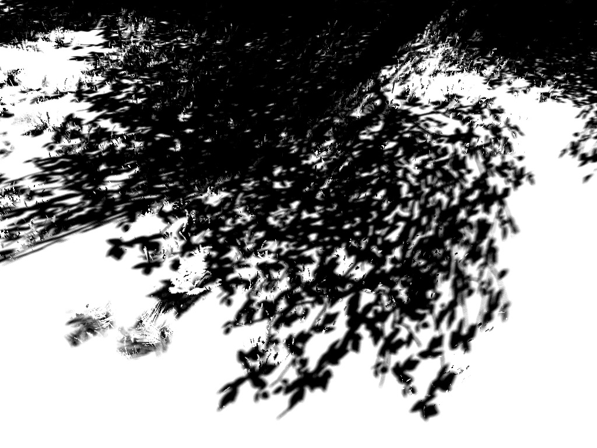

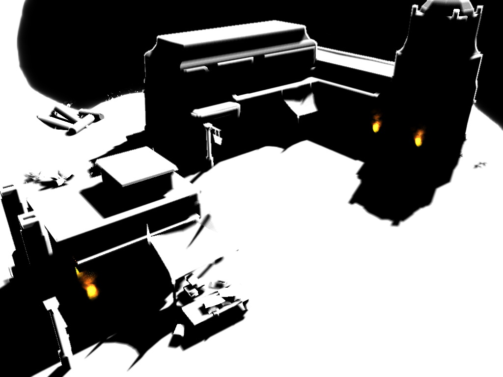

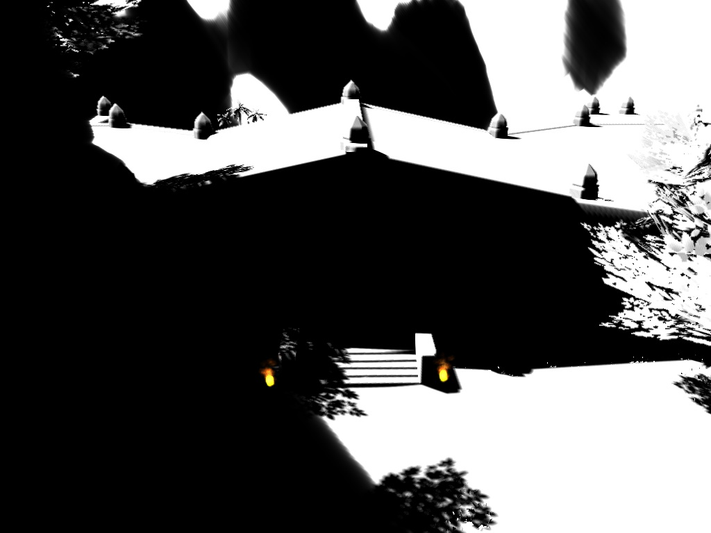

CryENGINE 中的 AO 是 SSAO 第一次被应用到游戏中，这才炒热了实时间接光照。CryENGINE 的 AO 技术并不是目前效果最好的，但是它的 Blur 却是最快的，也就是因为超快的 Blur，使得它可以应用 FullAO，而不是 HalfAO，因为 FullAO 的使用，叶子或者草之类的高频物体的 AO 变得比较好，所以总体来说，也算是个不错的 AO 解决方案。因为 CryENGINE 的渲染体系是没有 Normal 可用的，所以仅 Depth 采样所得到的 AO 或多或少会有一些问题，所以只能说，这个是目前仅深度 AO 中，较好的效果，因为它的全局性非常强，这得益于算法中会根据距离来缩放射线长度，所以 CryENGINE 的 AO 非常显眼，不像有些 AO 的效果离远了就容易被忽略。CryENGINE 的 AO 是全精度计算的，这可能会导致比较大的开销，所以 CryENGINE 对采样进行了优化，主采样使用屏幕原大小的图，然后对周围采样时候则用了缩小后的 Half 图，这节省了一些采样时间，也引起了一个竖条状的失真，这个可以在 Crysis 中见到，雪天的门口比较明显。随机图方面，CryENGINE 用了一张4*4的图，一共16种，这使得它的杂点非常难看，但是却给 BlurAO 带来了便利，因为只需要四次采样，加上线性过滤，就能得到完全平滑的 AO 效果了，这比起 Nvidia 的 HBAO 要快得多。不过这样的 AO 仍然有比较多的缺点，比如角色的后面容易黑，低多边形镶嵌的痕迹明显，还有就是 Blur 后会造成象素的偏差，所以 Crysis 中也容易看到 AO 中有亮边，但这不影响这个 AO 全局性好的特点。不过具体如何，还是仁者见仁。我使用这个 AO 方案是因为草叶之类的高频物件表现相对好的原因。

CryENGINE 还有个预计算的 TerrainAO，我暂时还没有机会去看。

下面发两张我的结果：


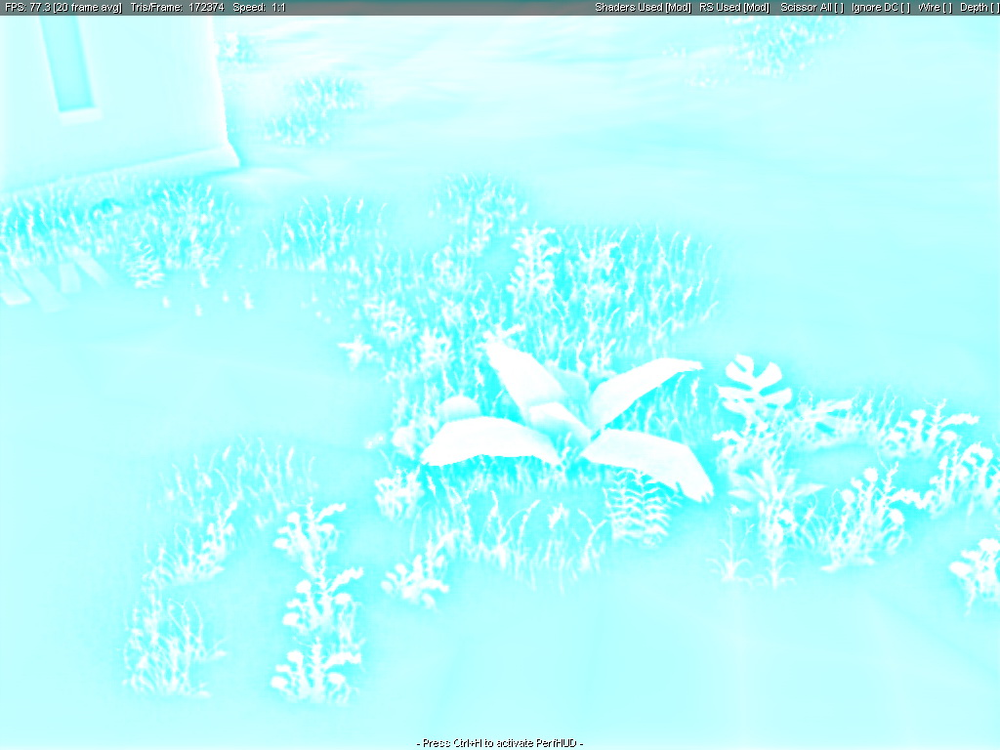

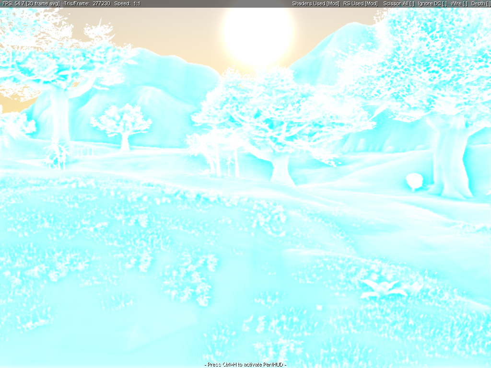

我的结论是远处，以及草叶表现较好，不过如果有 Normal 的话，还是非常大的改进余地。

[KlayGE][2] 中的 AO 是不是和 DX 中的 HDAO 差不多啊？感觉那个 AO 可以钩出非常细节的 AO 线，但是全局表现不如这个，怪不得叫 HDAO，如果能配上一些低频的 AO 的话，应该会更好看一些。Nvidia 的 HBAO 效果也挺好的，就是 Blur 老是出现点，但是可以比较好的解决低多边形镶嵌的痕迹，所以还是不错的解决方案。将来我会再尝试做个更好一些的 AO，目前这个仍然没有十分让人满意的方案。

最近我分别使用了下 CryENGINE 和 Unreal 的编辑器，相比之下，Unreal 的编辑器要更专业一些，虽然 CryENGINE 很强大，但是并不一定就是最为成功的商业引擎。Unreal 的材质连接器使得 Unreal 效果的扩展性要好很多，CryENGINE 相比之下也只是拥有更强大的内建渲染功能，作为一款引擎，与 Unreal 的积累上仍然存在一些差距。当然说到效果，比起 Lightmass 所展现出的静态 GI，CryENGINE 也没有办法弄出相应的动态解决方案。目前还是会有很多人觉得虚幻的室内效果更为完美，即使那要以牺牲动态光影为代价。


## Occlusion Culling

我先在这里面简单说一下 CryENGINE 中 OC 的理念，其实我也是这么想的，只不过GPU精粹上的说法和这个大相径庭，不过看到 CryENGINE 的做法后，我像是有了靠山一般，很心安理得地也这么做了。当然，我说的 OC 是指 Query 的 OC，其它使用 CPU 的 OC 方法不在这里面讨论。Query 和回读差不多，都需要等待显卡指令执行完成，才能得到结果，如果在当帧疯狂查询，那 OC 会直接给予帧率毁灭性打击。GPU精粹上有一种优化 OC 的方案，但是这个方案只是减少了帧中查询的数目，并没有解决查询直接导致处理器空闲的问题，所以得到的性能增益非常有限，如果用这种方案来做一个游戏的话，场景规模会有相当大的限制。CryENGINE 的 OC 还是在我的意料之中，它在帧头，也就是 Begin 之后进行查询，这样的好处是，因为 Begin 已经等待显卡完成所有操作了，所以在 Begin 之后的查询就会相当迅速，不会因为同步白白浪费宝贵的 CPU 周期。得到结果后已经晚了一帧了，可以在渲染的时候直接应用，当然也可以等到下一帧场景管理器 Cull 的时候大幅度减轻 CPU 负载，不过那样的话，OC 结果就需要延迟应用两帧，CryENGINE 可能是两种中的一种，我个人猜测应该是延两帧的，毕竟宝贵的 CPU 对 CryENGINE 来说可是要计算几乎全部次世代物理的，在场景规模和视距都如此巨大的情况下，节省下这些资源是很有必要的。这时有人就会发现了，那不是会出现结果错误的情况，两帧的会比一帧的更严重。事实也确实如此，但这就是我之前提到过的瑕疵优化，有如此可观的性能提升，即使有瑕疵，仍然是合算的，因为毕竟 OC 的错误并不是无法接受的。原因有以下几点：

 * 想要在同代硬件上加大场景规模，很多 LOD 的技术都会引起跳动和突变，有些远处的东西本来就会突然消失，OC 导致的消失只不过是增多了会消失的机会罢了。

 * 本来就要使用非常粗糙甚至刻意加大的模型代理来 OC，这种粗糙会反过来减少 OC 错误的机会，所以 OC 错误可以很大程度地被减小，有特别刺眼的消失只要加大代理就行了。

 * 相机的高速移动机会并不是很多。

 * 事实证明了 Crysis 疯狂的跳动突变完全被场大规模的场景以及超高规格的细节所掩盖了。

我们对 OC 的需求是在最低帧率至少不降的前提下，可以较为可观地提高平均帧率，最完美是能同时解放 GPU 和 CPU，而不是完美的无缝。下面发图来大致看下 CryENGINE 的 OC 结果。

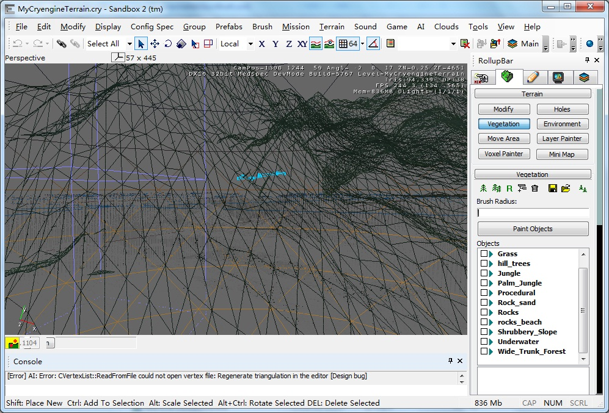

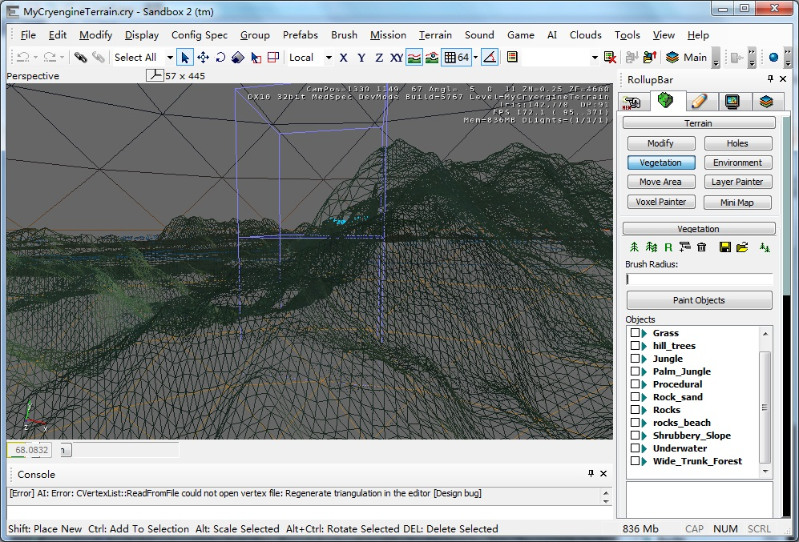

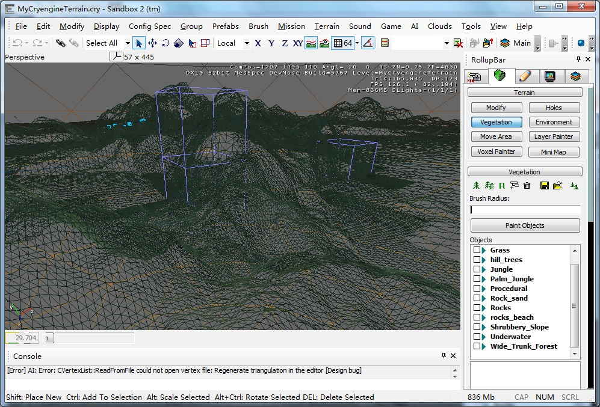

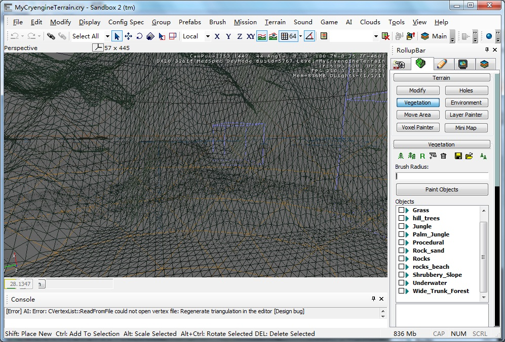

从图中可见，其实 OC 并不是那么精确的，太精确的 OC 反而对性能无益。目前好像有个 OC 引擎叫 Umbra，可能这方面会比 Crytek 做得更精一些。


## HDR

HDR 可以说是 CryENGINE 的一个强项，也可以说 CryENGINE 把 HDR 的效果推到了前所未有的高度，总之 CryENGINE 如此照片的渲染结果和它的 HDR 关系最为密切。

众所周知，HDR 是近年来最热门的技术之一，引擎如果不能很好地支持 HDR 一定会被划出一流引擎的行列。CryENGINE1 和 Unreal3 都相继支持了这个在当时象征着未来的革命性技术。HDR 和 Bloom 有着本质的区别，虽然很多人会觉得差不多，但是 HDR 比 Bloom 多出的部分才是 HDR 的精髓。就算说 HDR 才是现世代(几年前的次世代)顶级渲染技术的根本也不为过。真实的光照会带来几十几百倍的亮度差距，而用以显示的设备却只能有一个固定有限的亮度范围，用有限的LR（低范围）设备来表现HR（高范围）的世界是一项挑战，最终我们需要一种技术把 HR 动态地映射到 LR 的设备上，这就是 HDR。照片就是这种效果的典范，照片一样是LR（低范围）这与游戏中的情况一样，为啥我们却能觉得照片的还原度更好，是因为照片有个曝光的过程，通常看到的照片就是曝光较好情况，而如果自己拍摄，经常会遇到曝光不好的情况，曝光其实就是一种 HDR 的映射过程，人眼也有类似的过程。而对于 LR 无法表现的超高亮，通常是以光晕的形式出现，这并不是谁定的，而是人眼这样的感光设备在识别世界的时候自然形成的，看到照片的光晕会觉得很亮其实是人脑的潜在暗示。当然人眼的范围比起显示设备要高得多了，所以 HDR 的目标就是往照片靠近。由此 HDR 最关键的技术就是 ToneMap，没有 ToneMap 就不叫 HDR。ToneMap 并不是那么容易，而且经常出现的方法效果都是非常不理想的，这个可以参考 DXDemo 中 HDR 相关的内容，这样的 ToneMap 效果根本就没有办法实用。CryENGINE2 在这个方面有了个非常大的突破，这使得 CryENGINE 的渲染效果如此接近照片，以致难以辨认。Amazing！


对比 Unreal3 中 HDR 的效果与 CryENGINE 我发现，Unreal3 的 ToneMap 范围很小，从室内出门的时候才稍稍能感觉到，而 CryENGINE2 的 ToneMap 却有异常夸张的作用，往往台起头，地面就会变成几乎黑色。如此大范围的 ToneMap 使得 CryENGINE 真正把做到了 HDR，并且比起 HDRLighting 那样灰蒙蒙的还原，CryENGINE 的还原使得场景异常艳丽，HDR 的魅力被 CryENGINE 发挥了出来。对于那些看多了被 Bloom 搞得饱和度过高的场景而恶心的朋友来说，CryENGINE 版 HDR 的舒适自然则尤为明显。饱和度高的艳给人恶心晕菜的感觉，降底饱和度也是 HDR 的一个非常大的作用，但通常见到的 HDR 总是把场景变得不那么艳了，CryENGINE 版的 HDR 则打破了这个，让人眼前一亮。CryENGINE 带给我们的惊艳大部分都是因为这样的 HDR 如此的艳。

经过分析，我了解了 CryENGINE 版 HDR 的过人之处，再一次深深感叹日尔曼民族的强大。CryENGINE 的 HDR 并没有使用 ToneMapping 文献中描述的 ToneMap 公式。线性的 ToneMap 不单还原差，而且会非常明显地削弱对比度，使得场景非常平，而没有生气，其次，即使用了 Lwhite 作为门限来提升对比度，但过低的门限会造成曝过过度，过高呢，仍然无法解决对比度削弱的问题，这也就是为什么 DX 的 HDRLighting 无法实用的原因。不过 CryENGINE 则使用了更好的 ToneMap 方法，称为 ExpToneMap，其实这个也早就出来了，就是没人实实在在地去实现罢了。顾名思义，ExpToneMap 会渐渐挤压远离平均亮度的颜色，而且挤压非匀速，这就产生了有很趣的效果，而且这能很好地同时挤压亮与暗的颜色，使得有效果的对比度能够很好地还原，再也不会出现平均颜色的结果了。不过，光有 ExpToneMap 是不够的，有心的人可以注意到，CryENGINE 的 Bloom 也非常真实，比起虚幻巨大的光晕，CryENGINE 的 Bloom 层次更多，效果更好。事实确实如此，Bloom 在 CryENGINE 中是被强化的，Bloom 分成两部分，一是 BrightPassBloom，二是 ExtraGlow。先说 BrightPassBloom，这个就是一般 HDR 中的 Bloom，但是 CryENGINE 中的实现却非常不同，CryENGINE 中一共用了6个 GaussianBlur，加上两次 HalfSample，一次 BrightPass，一次 FinalMerge，总共是十个批次，而且每个 Buffer 都是64位的，所以 CryENGINE 花了非常多的资源用于 Bloom 的生成，当然结果是喜人的。把 1/2 1/4 1/8 的三层 GaussianBlur 的结果叠加，出现了一个非常有层次的 Bloom，而且在 ToneMap 之前就添加进 HR 的颜色中，这样有效地防止了 Bloom 提高过多的饱和度，使 Bloom 看起来非常有层次。ExtraGlow 也是如此，三层叠加，区别是 ExtraGlow 是 LR 的，用于处理一些特殊材质的物件的 Bloom。这才有了 CryENGINE 最终的效果。

值得一提的是，需要有正常的 HDR 效果，拥有 HDR 的天空是非常重要的。如果做静态天空的话，可以去下到 HDR 的天空盒，动态天空的话，需要计算大气散射。CryENGINE 的大气散射计算过程是看不见的，所以我自己做了一个，方法就是 Siggraph1993 的文献中说的。最终才得到了 CryENGINE 般喜人的效果。HDR 花了我很久，但是从我修改 OGRE 的曲线来看，HDR 的完成一次性把我的渲染特性提升了一个档次，可见效果有多么显著。

以下是我早期的截屏，很好地说明了 HDR ToneMap 的过程，可以看到，整个过程的色彩还原都是非常好的。

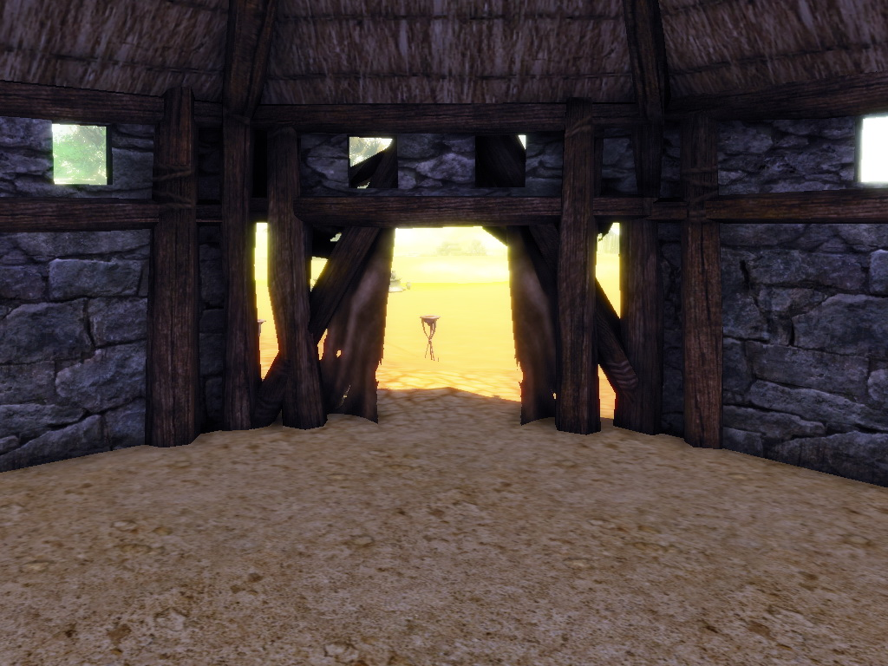

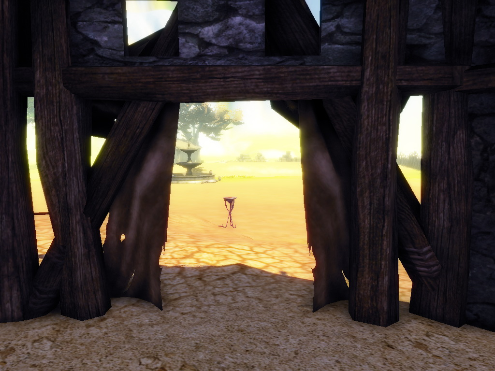

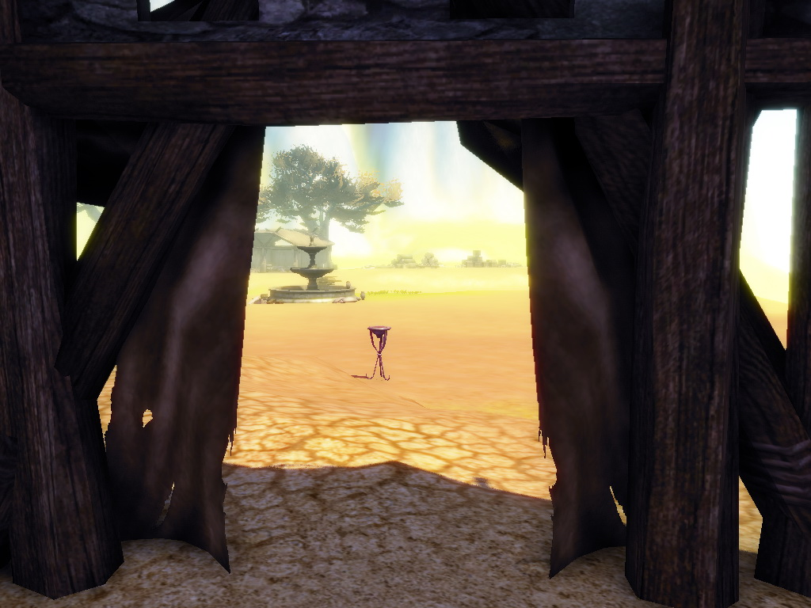

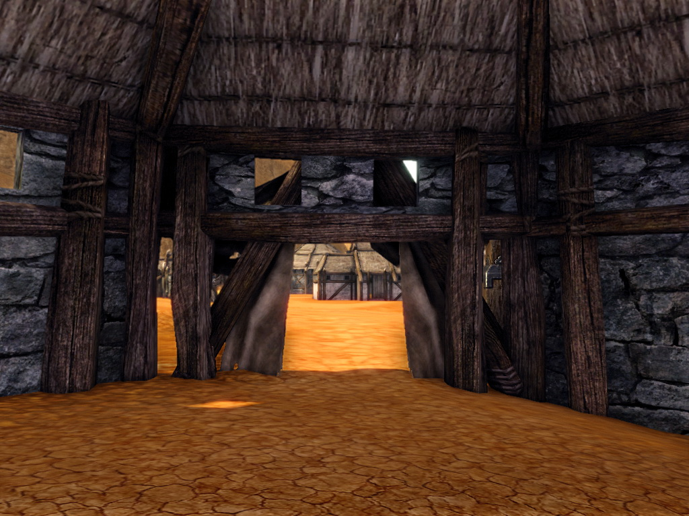

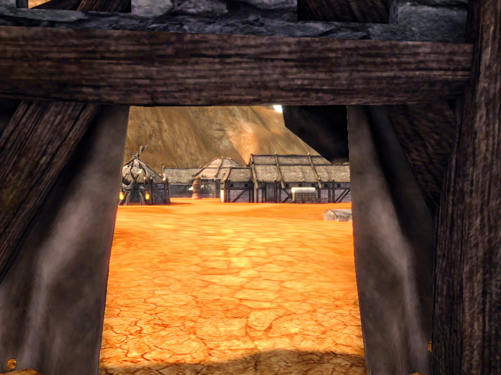

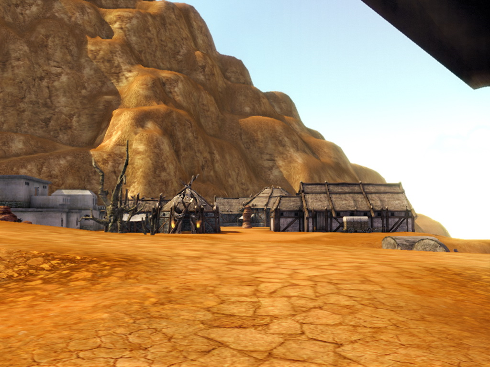


## Color Grading

Color Grading 其实是一堆的滤镜效果的集合，里面用了许多相当实用的滤镜。在引擎渲染的最后使用一些滤镜可以很好地使画面适合实际需要，使得渲染结果更加容易控制。这样的理念非常值得推荐，所有所有都围绕着 Artist Friend 进行。其中有一个效果值得一提，就是 Color Sharping，计算方法竟然是把 Scene - SceneBlur*d，d为一个很小的值。也不知道谁发明的这方法，减去模糊的部分，突出细节。

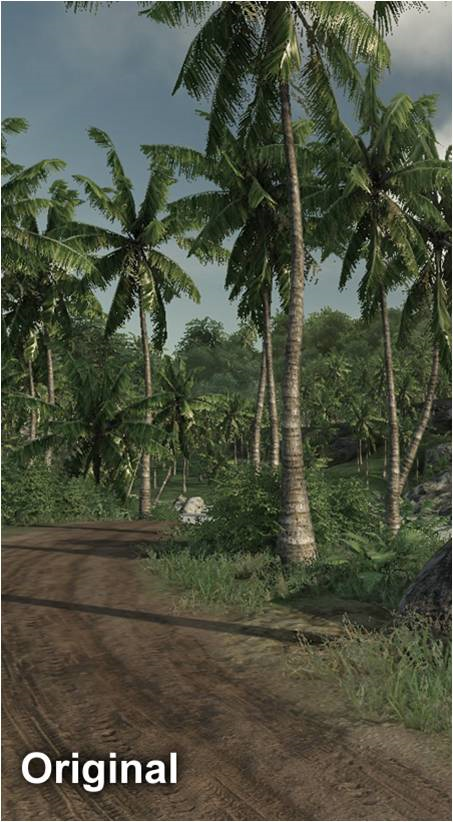


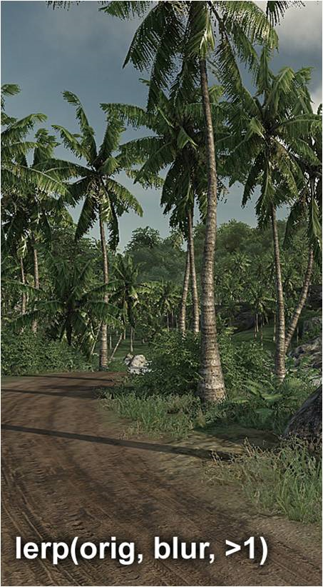

经过数次的滤镜处理，渲染结果还是有比较不错的变化

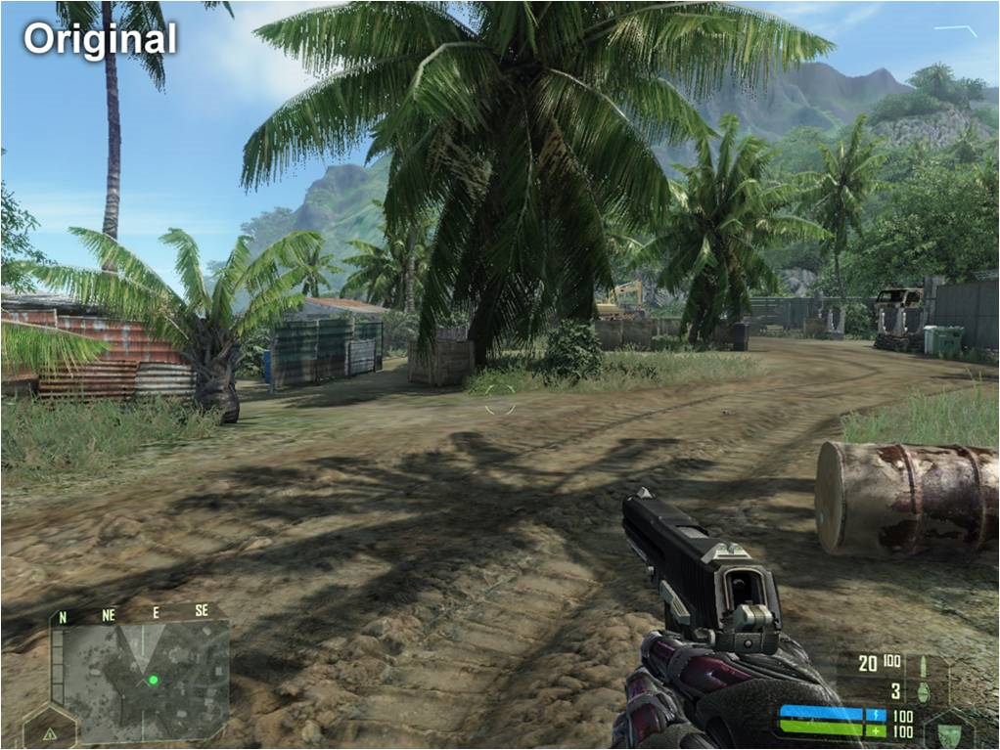


在我的渲染中也添加了这样的特性，效果挺不错，据说 CryENGINE3 加强了这个效果，不知道又加入了什么好玩的东西。

在 1024x768 的情况下，他的四点是

```
0.000928,0.000326
-0.000244,0.001250
-0.000937,-0.000326
0.000244,-0.001250
```

当然是在线性采样的情况下进行的，另外 SunShaft 也利用了这个 Kernel 进行Blur。CryENGINE 的 Kernel 都是奇形怪状的，很少有对称的。

SSAO 并没有带给 Crysis 什么画质提升，只是弥补了动态场景中缺少间接照明的缺陷，但其效果仍然离虚幻的 LightMass 很远。真正让我们眼前一亮的就是 HDR。

AlphaTest 和 Clip 是特殊情况，会直接导致在 Clear 前 EarlyZ 失效的，所以一定要排序，而且使用这些的情况下只填充深度无法有双倍渲染速度的增益。但是由于填充占用带宽，所以即使不能双倍，但开启 Test 或者 Clip 仍然会有性能节省。


[1]:https://www.cnblogs.com/Zephyroal/archive/2010/10/16/1852884.html
[2]:http://www.klayge.org/
[3]:https://developer.nvidia.com/nvidia-perfhud
[4]:http://www.gamebryo.com/
[5]:https://www.ogre3d.org/
[6]:http://irrlicht.sourceforge.net/
[7]:https://napoleon314.github.io
[8]:https://github.com/Napoleon314/XMath
