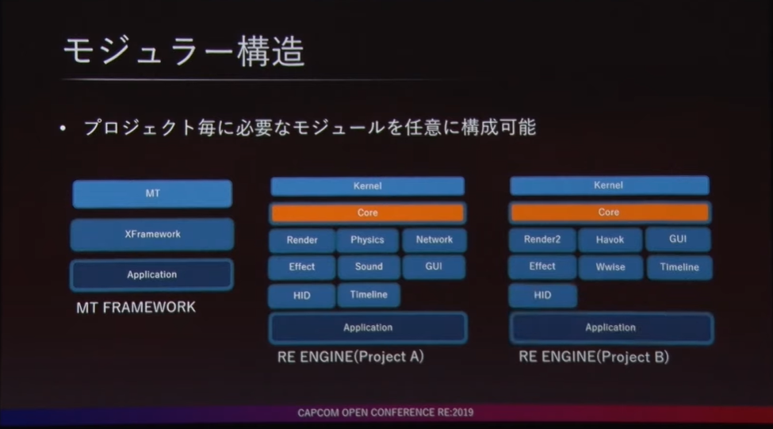
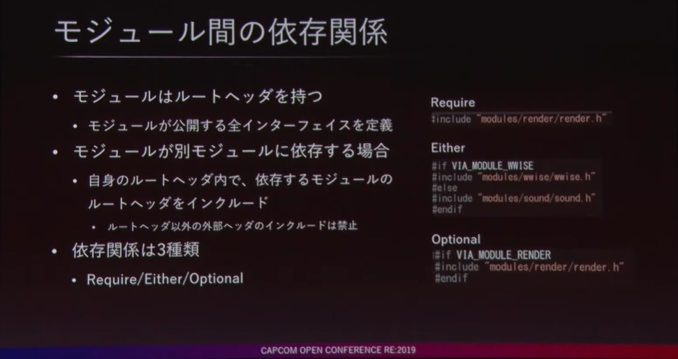
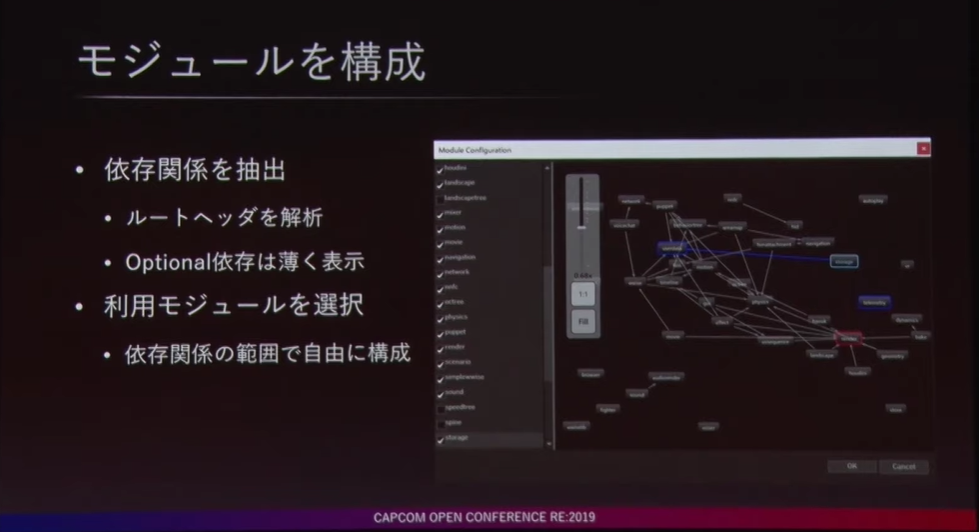
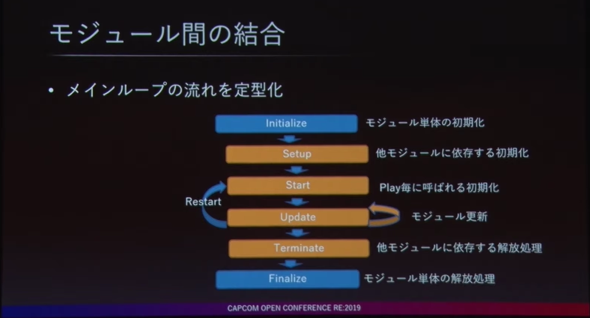
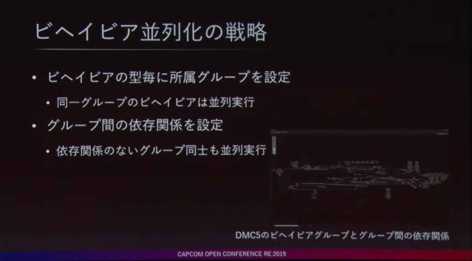
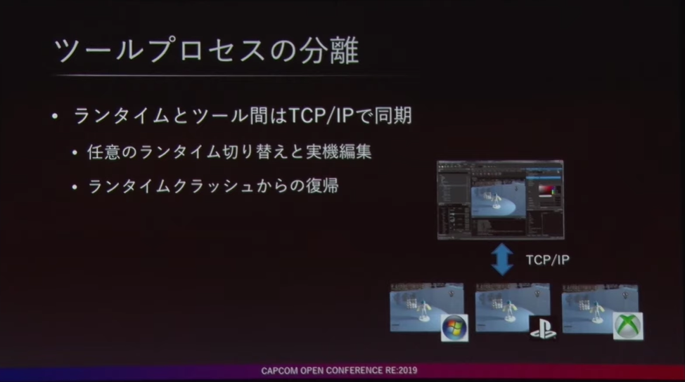
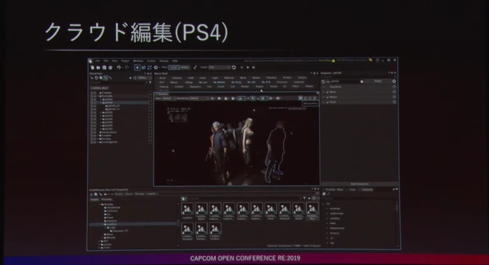
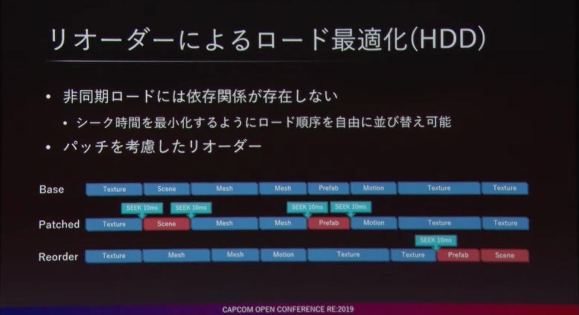
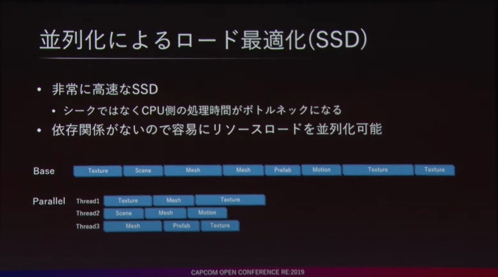
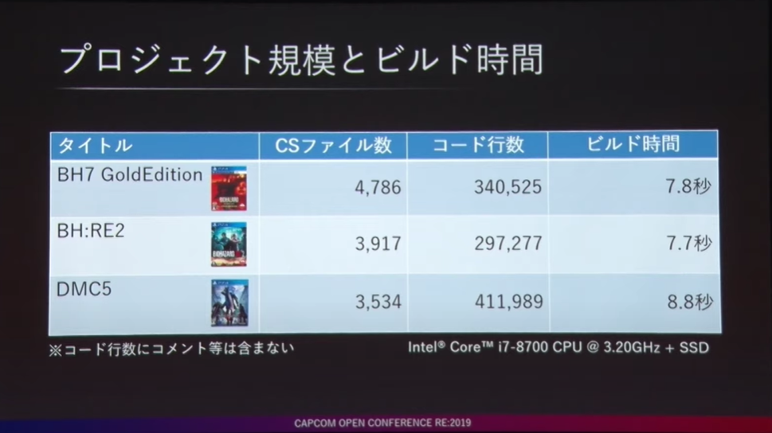

# Architecture of RE ENGINE - Creating an All-Purpose Engine

* [Youtube：CAPCOM Open Conference RE:2019][1]
* [Youtube：RE ENGINE 的故事][4]
* [Wikipedia][2]

## CAPCOM in-house engine 历史

* 2000年，Oni3 Engine，更像一个 library
* 2005年，MT FRAMEWORK，统一的公司内引擎（当次代）
* 2017年，RE ENGINE，下一代

RE ENGINE 代表作

* Resident Evil 7: Biohazard，《生化危机7》
* Devil May Cry 5，《鬼泣5》
* Monster Hunter: Rise，《怪物猎人：崛起》

## RE ENGINE 设计哲学

* 一个引擎，用于所有项目
* 支持快速的迭代

## RE ENGINE 特性

* 特性1：模块化设计
* 特性2：向下兼容性
* 特性3：Editor & Rendering 分离
* 特性4：异步 I/O
* 特性5：C# Scripting

特性3-5可以参见 GCC 2017 的分享。本篇重点讲前两者。

* [Achieve Rapid Iteration: RE ENGINE Design][4] ([ppt][3])

## 特性1 - 模块化设计

* 允许替换引擎核心模块

### 模块间依赖

* 模块间的头文件的使用，存在三种关系
* Require，直接使用
* Either，通过宏选择
* Optional，通过宏开/关

### 依赖管理

* 专门的 Module Configuration 程序
* 独立管理所有 module 之间的依赖
* 不同游戏，有不同的依赖图（可以取消不需要的 module）

### 模块的生命期

* Initialize，模块初始化
  * Setup，和其它模块相关的初始化
  * Start，游戏启动执行一次
  * Update，每帧tick
  * Terminate，和其它模块相关的释放
* Finalize，模块释放

### 模块与MainLoop的关系

* 右边是引擎的 MainLoop，一帧内从上到下执行
* 左边是一个模块实现对应的接口，可以对接到引擎 MainLoop 不同阶段去执行

### 并行化(JobSystem)

* 上图是《鬼泣5》中的 job-dependency graph
* 下图是 PS4 上 Core-0 的利用率
* 引擎根据 Module Configuration 配置的依赖关系，做并行化

## 特性2 - 向下兼容性

* 让老项目可以跑在新引擎上

### Project Settings

* RE ENGINE 不同版本之间，如何保证渲染效果的兼容
* 将变化的内容抽象为工程配置（如图：选择不同的 Shading Model）
* 不同配置启用不同流程，甚至是完全不同的模块代码

### 老游戏的维护

* 左边是老引擎，右边是 RE ENGINE
* 从项目组转交给引擎组维护
* **老项目重制版本身就是新引擎的验证**

## 特性3 - Editor & Rendering 分离

* 对于 renderer，绝对的 data-driven
* Editor 编辑好的数据，通过 TCP/IP 送给不同的 renderer (PC/PS4/XBOX)

* 编辑的数据，实时发送给 PS4
* PS4 再将显示内容，传回给 Editor

## 特性4 - 异步 I/O

* 只允许 Async-I/O 任务
* 底层可针对不同情况进行优化，比如
* HDD：根据所需要加载任务的位置，减少 seek time
* SSD：各种快，直接并行加载

## 特性5 - C# Scripting

* 游戏逻辑使用 C#
* 独立维护的 C# VM (REVM)
* 改良的 GC 机制 (FrameGC)

### 更快的编译时间

* 三个游戏的CS源文件数、代码行数、编译时间

## 总结

* 没有一页页翻译
* `模块化设计`和`Editor/Rendering分离`比较有意思

[1]:https://www.youtube.com/watch?v=fc3avwM-oTE&list=PLwr4vGtPYCqVKTBtoRqiy1-UY-rxbgG43
[2]:https://residentevil.fandom.com/wiki/RE_Engine
[3]:https://www.slideshare.net/capcom_rd/re-engine-72302524
[4]:https://www.youtube.com/watch?v=GPKmzZOkAD8
[5]:2021_03_10_achieve_rapid_iteration_re_engine_design.md
