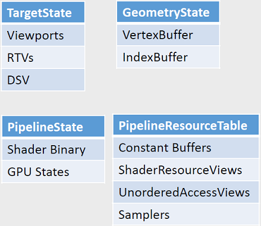

# RE ENGINE - GPU-Driven Rendering

* https://www.slideshare.net/capcom_rd/gpu-59175056


## 大纲

* Rendering pipeline
* Mesh renderer
* Light culling


## Rendering Pipeline

* For multi-platform
  * Intermediate drawing command
  * Native drawing instructions
  * Resource management

```
Intermediate drawing command => Sort drawing instructions => Native drawing command
```


### Intermediate drawing command

* Used by programmers
  * In-house drawing command
    * Multithread
    * Build-in drawing context
  * Instruction reuse


### Intermediate drawing command

* Basic instructions are DirectX 11 style
  * DX12 generation features
    * Multi Draw and Async Compute
    * Low cost use of 32-bit constants
  * General instructions
    * Copy, Update Buffer
    * Draw, Dispatch, etc.
  * Specify priority


### Drawing context

* Interface for creating drawing instructions
  * Exists for each thread
    * Holds a unique thread ID
  * Priority setting
  * Settings for various drawing resources
  * Shader and resource integrity check
  * Create intermediate drawing instructions


### Types of drawing instruction resources

* Elements required for graphics
  * Texture,
  * Shader Binary,
  * ShaderResourceView,
  * UnordredAccessView,
  * VertexBuffer,
  * Index Buffer...


### Resource management of drawing instructions

* Object reference status is managed by reference counting
* Resource lifetime management
  * Must be guaranteed to survive until drawing is complete
  * Needs separate lifetime management than the reference counter
    * Lifetime management uses security frames
      * Guarantee frame substitutes current frame + n at reference
    * The guaranteed frame exceeds the current frame and the reference count with 0 is released from the memory
  * Lifetime management is at the time of issuing the drawing command 


### Resource configuration of drawing instructions

* Consists of multiple resources
  * High setup cost
    * Collecting resources
    * Update guarantee frame to collected resources
  * A large number of drawing commands during in-game
  * Setup costs cannot be ignored


### Reuse of drawing instruction resources

* Empirically, the drawing command is not much different from the previous drawing.
  * Draw mesh
    * Send almost the same combination of resources each time
    * It is the content of the resource that is updated, the handle is fixed
  * Drawing particles
    * Resources to use are predetermined
* Reuse as same as last time
  * Improve CPU performance


### Resource expansion

* Aggregate resources into meaningful units
  * Created at initialization
  * Reuse in multiple frames
  * Manage internal resources
    * At creation time
      * Only the reference counter of the resource you have updated at creation
    * At release
      * Reflected in the resources that have the guarantee
    * Update check drops to play
* Created at runtime
  * PipelineResourceTable
    * Because what you need at run time is determined
  * Reuse to reduce drawing costs




### Drawing resources to send

* Four resources for the Draw instruction


### Multithreading of intermediate drawing instructions

* Native drawing instructions are executed in the order of priority of intermediate drawing instructions
  * Issuance of intermediate drawing instructions can be separated from actual drawing
* Execution of translucent and opaque instructions


### Multithreading of intermediate drawing instructions

* Priority application example
  * Optimize drawing order
    * Drawing in front order to make EarlyZ work
    * Back-order drawing for translucent consistency
  * Controlling data copy timing
  * Adjusting compute shader dependent resources
  * Delayed check process


### Adjusting Compute Shader Dependent Resources

* Stall where UAV and SRV ping pong in CS
  * Problems with GPU sorting, simulation, etc.
  * Adjust priorities so that dependent resources are not processed continuously
  * Mix with other CS to avoid


### 