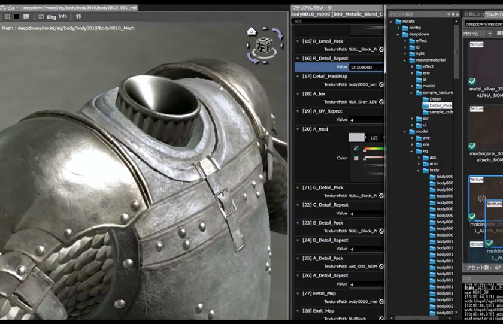
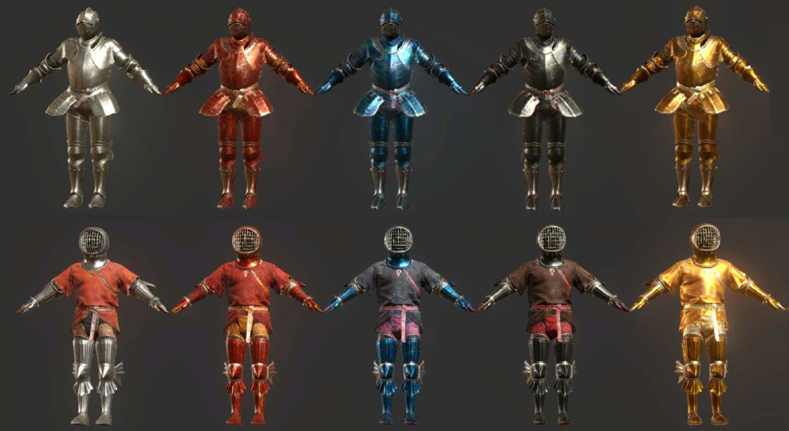
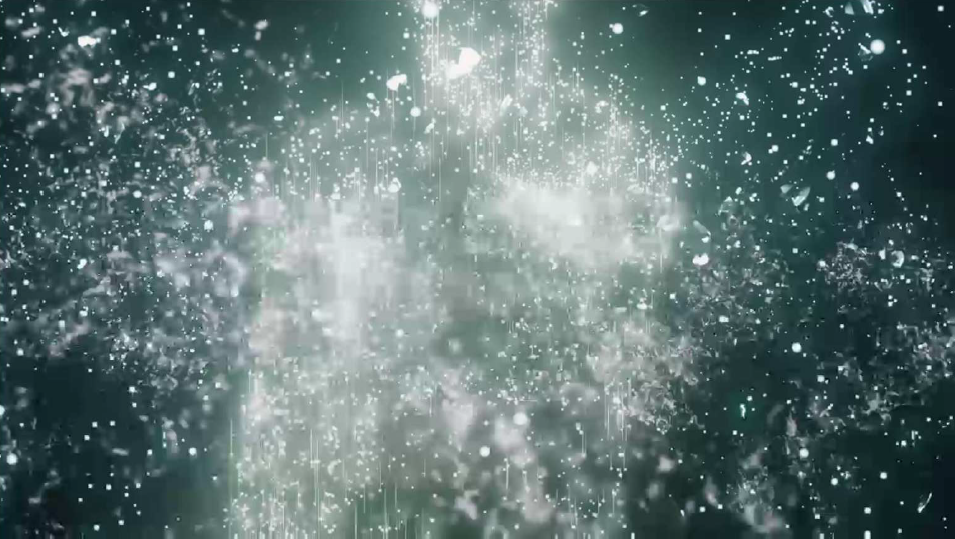

# Technical Explanation of "Deep Down" Graphics

* "Deep Down"
  * https://www.youtube.com/watch?v=jIRUImPWaOo

## Agenda

* Material
* Light
* Hair

## Material

### Panta Rhei's objective

* High quality texture
  * Make it look richer than ever
* Unification of quality
  * Have similar quality no matter who makes it
  * Use it anywhere = separate lighting
* "Physically Based Rendering" to achieve

### Material

* Normal shading
  * OrenNayer + GGX
    * At the time of TGS exhibition, it was Oren Nayer + Blinn Phong, but it will be changed later
* Skin shading
  * Pre-integrated Skin Shading + GGX

### GGX

* Beautiful highlights of details
  * Leather, metal and plastic textures are more flexible than Blinn-Phong

### Skin sample

### Texture adjustment value

Value to adjust   | Meaning 
----------------- | -----------------------------------------------------------------
Albedo            | Diffuse reflectance Non-metals have color, metals are black
Reflectance       | Gloss reflectance Non-metals are almost black, metals have colors
Glossiness        | Surface smoothness
Normal            | Normal
Emissive          | Optional self-luminous component

Panta Rhei uses [3D-Coat][1] and MAYA shaders to make adjustments using these values

### Shader editor

* Create shaders with graphical editing
  * Graph method for editing by linking nodes

* Instant preview available

### Detail layer

### Water monster

### Screen space effect 

### Shader editor pros/cons

* Pros
  * Artists can create while checking the appearance for themselves
* Cons
  * The number of nodes increases and tends to be complicated
  * Performance is not considered

### Comparison with the conventional

* Conventional (MT FRAMEWORK)
  * Material (setting based on empirical rules)
  * A combination of shader nodes
* Currently (Panta Rhei)
  * Material (Physically based. Created with a small number of parameters)
  * Artist-based shaders

## Light

### Panta Rhei's objective

* Dynamic light source processing as much as possible
  * Automatically generated dungeons
    * No lightmap in the dungeon
  * handle indirect lighting dynamically
* Improved rendering quality

### Lighting

* HDR lighting & linear space
  * Rendered in FP16
* In-game lighting
  * Direct lighting
    * Tile-based deferred + forward
  * Indirect lighting
    * Irradiance volume + parallax correction environment map

### Rendering Pipeline

[1]:https://3dcoat.com/
