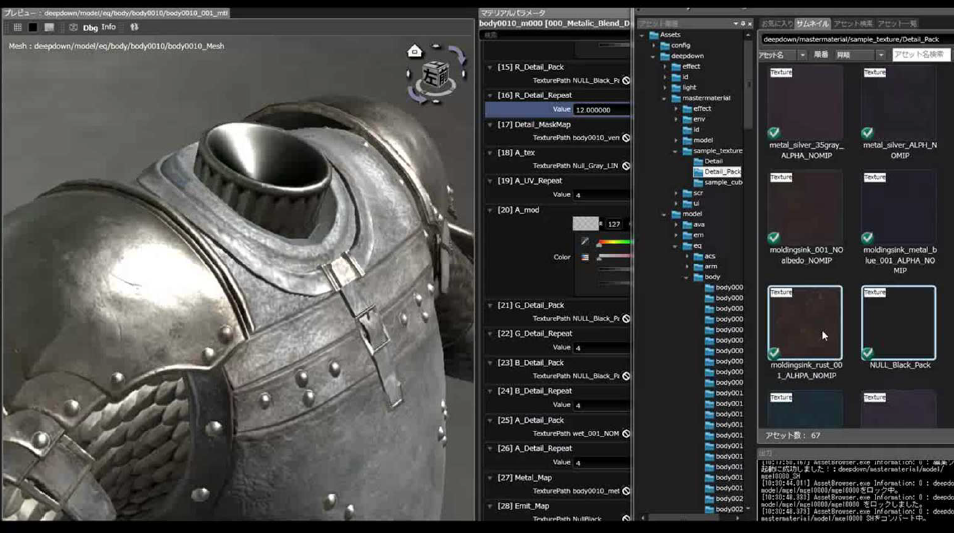
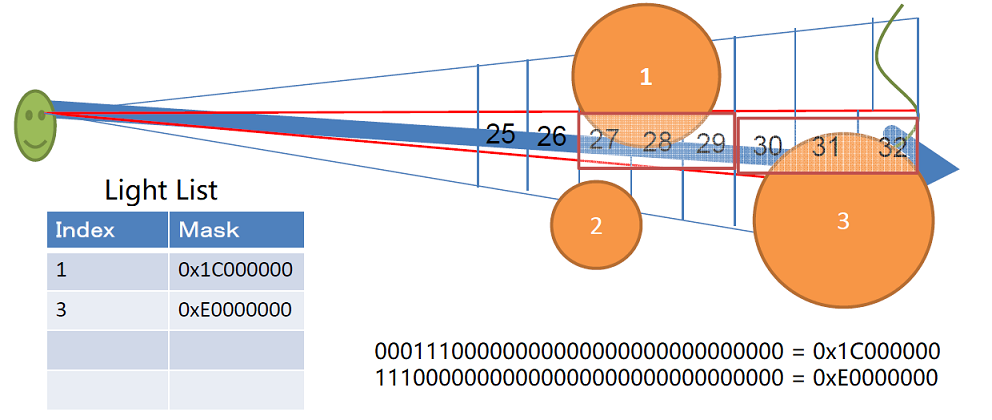

# Technical Explanation of "Deep Down" Graphics

* "Deep Down"
  * https://www.youtube.com/watch?v=jIRUImPWaOo

## Agenda

* Material
* Light
* Hair

## Material

### Panta Rhei's objective

* High quality texture
  * Make it look richer than ever
* Unification of quality
  * Have similar quality no matter who makes it
  * Use it anywhere = separate lighting
* "Physically Based Rendering" to achieve

### Material

* Normal shading
  * OrenNayer + GGX
    * At the time of TGS exhibition, it was Oren Nayer + Blinn Phong, but it will be changed later
* Skin shading
  * Pre-integrated Skin Shading + GGX

### GGX

* Beautiful highlights of details
  * Leather, metal and plastic textures are more flexible than Blinn-Phong

### Skin sample

### Texture adjustment value

Value to adjust   | Meaning 
----------------- | -----------------------------------------------------------------
Albedo            | Diffuse reflectance Non-metals have color, metals are black
Reflectance       | Gloss reflectance Non-metals are almost black, metals have colors
Glossiness        | Surface smoothness
Normal            | Normal
Emissive          | Optional self-luminous component

Panta Rhei uses [3D-Coat][1] and MAYA shaders to make adjustments using these values

### Shader editor

* Create shaders with graphical editing
  * Graph method for editing by linking nodes

* Instant preview available

### Detail layer

### Water monster

### Screen space effect 

### Shader editor pros/cons

* Pros
  * Artists can create while checking the appearance for themselves
* Cons
  * The number of nodes increases and tends to be complicated
  * Performance is not considered

### Comparison with the conventional

* Conventional (MT FRAMEWORK)
  * Material (setting based on empirical rules)
  * A combination of shader nodes
* Currently (Panta Rhei)
  * Material (Physically based. Created with a small number of parameters)
  * Artist-based shaders

## Light

### Panta Rhei's objective

* Dynamic light source processing as much as possible
  * Automatically generated dungeons
    * No lightmap in the dungeon
  * handle indirect lighting dynamically
* Improved rendering quality

### Lighting

* HDR lighting & linear space
  * Rendered in FP16
* In-game lighting
  * Direct lighting
    * Tile-based deferred + forward
  * Indirect lighting
    * Irradiance volume + parallax correction environment map

### Rendering Pipeline

### GBuffer

* Albedo and Reflectance compressed with YCbCr
  * Cb and Cr are stored alternately in pixel units in RT3
* Options: Save decal information, BRDF type

### Problems with YCbC

* Albedo and reflectance with YCbCr
  * Due to the nature of encoding, color difference information
  * Colors close to black cannot be reproduced accurately
    * Purple etc. occur when exposed to high brightness
    * 8-bit accuracy
* It is better to put RGB normally
  * Consider introducing Metallic's idea for the same capacity

### Rendering Pipeline

### Tile Based Deferred Shading

* Two-stage configuration
  * Create light list
    * Creating light information that is also used for translucency, etc.
* Direct lighting processing

### Light list

* Create a light list by dividing the image into 16x16 units
  * Create a frustum from tile depth information
    * Divide the frastam into 32 pieces in the line-of-sight direction
      * The 32nd is a frustum in the range of maximum and minimum depth values
      * The rest is a frustum divided evenly from the minimum value
      * Judgment of intersection with the light source for each frustum

### Creating a light list

* Calculate and save the number of lights after culling
  * Get memory blocks from the writelist pool
    * Keep head offset and number of tiles
* The pool is uint2's Structured Buffer
  * 32-bit write index
  * 32-bit culling mask

### Light culling

### Direct lighting

* Processed as a light source with size
  * Spherical light source only
    * Light intensity, magnitude, distance squared attenuation
  * Points, spots, directional
  * Supports shadow and projected textures

### Example of direct lighting

### Direct lighting shader

* Process images in 16x16 units with CS
  * Get from light list
    * Get only lights with the 32nd bit enabled
    * Stored in Shared Memory for each light type
  * Expand loops by light type
    * Use the best calculation within each loop
    * VGPR bloated when shadow filter is involved

### Rendering Pipeline

### Forward

* Used for skin and translucent
  * Lighting using the results of the light list
* Search for the mask of the light list from the Z value at the time of drawing
  * Supports shadow and texture projection

### Rendering Pipeline

### Indirect lighting

### Indirect lighting

Processed at once with pixel shader

* Irradiance Volume
* Screen space reflection
* Parallax Corrected Cubemap

[1]:https://3dcoat.com/
