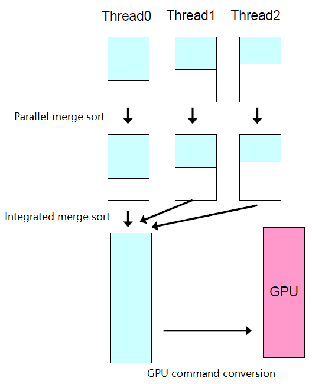
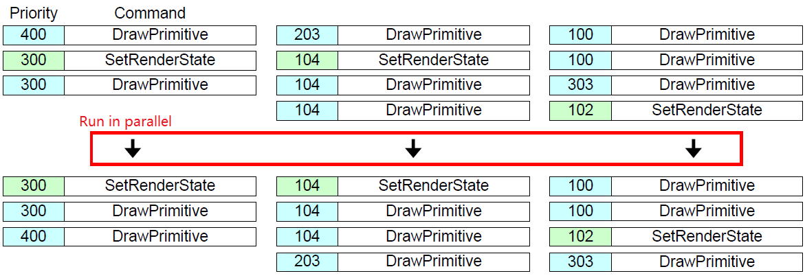
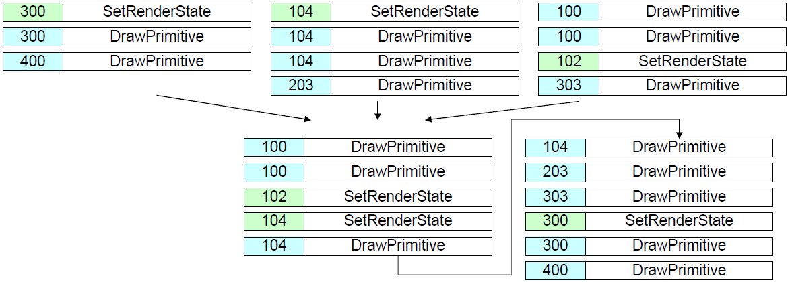

# Game Engine Design for Next Generation Consoles

* 石田智史
* 2006年 CEDEC，正好对应 MT FRAMEWORK 开始研发
  * https://en.wikipedia.org/wiki/MT_Framework
* Hardware (7th generation console)
  * PS3 - 2006.11
  * XBOX360 - 2005.11


## MT FRAMEWORK

* Game engine developed in-house
* Adopted titles for major next-generation consoles
  * Dead Rising, Lost Planet, BH5, DMC4, MH3
* Supports multiple platforms
  * XBOX360, PC (VISTA), PS3)
* Multi-core optimized design
* Tool-based architecture


## Agenda

* Utilization of multi-thread
* Rendering technique
* Tool architecture


## Utilization of multi-thread


### Next-generation CPU

* Multi-core CPU
  * CPU frequency improvement has peaked
    * TDP problem
  * CPU trends change
    * From improving frequency to increasing the number of cores
* Number of CPU cores
  * XBOX360
    * 3-Core x 2 SMT
  * PS3
    * 1-Core x 2 SMT + SPU x 7
  * PC
    * 1-Core ~ Main-Core
* **Multi-core / thread support for game programs is essential**


### Amdahl's law

* https://en.wikipedia.org/wiki/Amdahl's_law
* The overall execution time is constrained by the parts that cannot be parallelized.
  * For example, if there is a part that cannot be parallelized by 50%, no matter how much the degree of parallelism is improved, the speed cannot be increased more than twice.


* **It is important to increase the ratio of parallel execution**


### What to parallelize

* Module-based parallelization
  * Modularize rendering, sound, collision, motion, physics simulation, AI, etc. and process them in parallel
* Pros
  * High degree of parallelism can be obtained if dependencies can be minimized
* Cons
  * Module separation is difficult except for some
    * Because each module of the game program is closely dependent on each other.
  * When using SMT, cache efficiency deteriorates
    * Because completely different code works


### What to parallelize

* Parallelization in loop units
  * Distribute and process high-load, non-dependent loops in parallel
* Pros
  * Very good compatibility with SMT (Because the same code works)
* Cons
  * Not many non-dependent loops make up a few percent of game programs
  * Synchronous overhead outweighs low-volume loops


### What to parallelize

* Task-based parallelization
  * Tasks in game programming
    * Unit for updating and drawing every frame
    * Players, enemies, bullets, cameras, effect generators, etc.
  * Execute tasks with no dependencies in parallel
* Pros
  * Dependencies can be limited
    * Limited if information on other tasks is needed
  * SMT is more efficient when performing tasks with the same content
* Cons
  * Cannot be executed in parallel if there are no tasks with no dependencies

```
+-----------------------------------------------------+
| Character Task                                      |
| +---------------------+  +------------------------+ |
| | Update              |  | Rendering              | |
| +---------------------+  +------------------------+ |
| | Path finding        |  | Culling                | |
| | Motion              |  | Bone calculation       | |
| | Collision           |  | Lighting               | |
| | Posture calculation |  | Create drawing command | |
| | ...                 |  | ...                    | |
| +---------------------+  +------------------------+ |
+-----------------------------------------------------+
```


### Parallelization approach

* Module-based parallelization
  * Rendering, sound, resource loading
* Parallelization in loop units
  * Some sort processing etc.
* Task-based parallelization
  * All game objects (Players, enemies, effects, lights, cameras, etc.)
  * Divide task updates for each frame into **parallel updates** and **synchronous updates** to reduce the dependency between tasks during parallel updates.

```
Traditional task model      Parallelized task model
   +-------------+           +--------------------+
   | Update      |           | Parallel update    |
   +-------------+           +--------------------+
   | Rendering   |   ====>   | Synchronous update |
   +-------------+           +--------------------+
                             | Rendering          |
                             +--------------------+
```


### Game program flow

* Traditional game program flow
  * CPU and GPU run in parallel


* Parallelized game program flow
  * Multiple CPUs and GPUs run in parallel


### Parallel update

* Manage task dependencies on the line
  * Tasks with no dependencies are registered on the same line
  * Register dependent tasks on another line
* Multi-threaded parallel update on a line-by-line basis
  * Tasks on the same line cannot be changed or referenced
  * Tasks on different lines can only be referenced


### Synchronous update

* Sequential update of tasks with a single thread
  * You can freely refer to and change other tasks
* Update in the shortest time
  * Make one thread occupy cache and memory bandwidth
  * Disable unnecessary sync objects during sync update
* Minimize processing
  * If possible, only get the value and do the calculation at the next parallel update


### Parallel drawing command creation

* Execute all tasks in parallel with multiple threads
  * Your own state is for reference only and **cannot be changed**
  * Other tasks can only be referenced
  * Only registration to an independent command buffer for each thread is possible


### Problems of parallel drawing command creation

* The registration order of drawing commands is not stable
  * The registration order within the task is stable
  * The order of registration between tasks is indefinite
* Stable execution order regardless of registration order
  * Give priority to drawing commands
  * Finally sort by priority
    * Use a sort algorithm that preserves order
      * Merge sort
    * For the same priority, it depends on the registration order in the task
      * Stable


### Intermediate drawing command

* Describe drawing commands as an array of 64-bit tags
  * Consists of 32-bit priority and address to 32-bit command
* Breakdown of priorities
  * Scene
    * Define a completely independent scene (split screen, etc.)
  * Sub Scene
    * Define another scene (shadow map, reflection map, etc.) required when drawing the scene
  * Pass
    * Define rendering paths (Z pre-pass, opaque path, translucent path, filter path), etc.
  * Sub Priority
    * Priority in the path.
    * For example, in an opaque path, the material is prioritized and controlled so that material switching is minimized.
    * In the semi-transparent path, the distance from the viewpoint is prioritized and controlled so that it is drawn from the back to the front.


### Flow of drawing command creation

1. Create intermediate drawing commands in parallel with multiple threads in a command buffer that is independent for each thread
2. Parallel merge sort by command priority for each command buffer
3. Combine multiple command buffers into one command buffer with priority Merge sort
4. Converts a unified intermediate drawing command to a native drawing command and executes it




### Parallel merge sort

* Merge sort by command buffer
  * Merge sort in parallel in order of priority in units of command buffers that are independent for each thread
  * Order with the same priority is guaranteed




### Integrated merge sort

* Unify command buffer
  * Combines sorted command buffers that are independent for each thread into one command buffer in order of priority.
  * Usually merge sort is a merge of two elements, but the algorithm is extended so that arbitrary elements can be merged.



