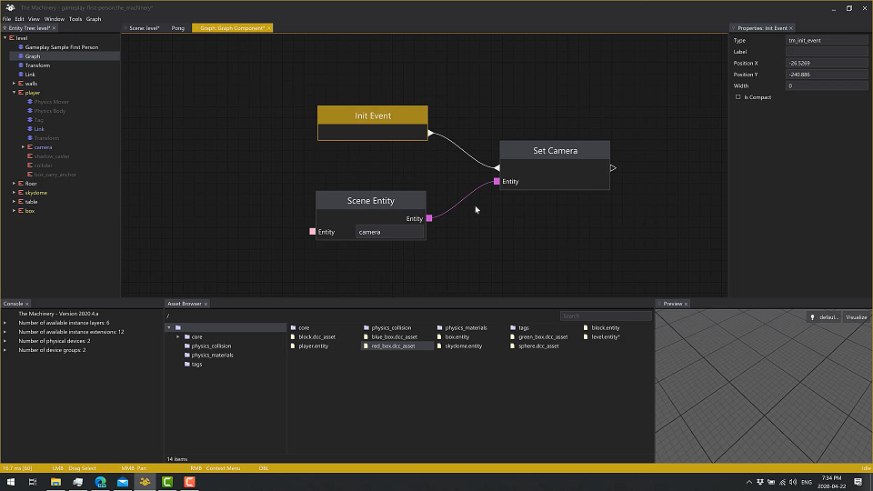

# Bitsquid, Stingray and the Machinery

## History

* 两位主创：Niklas Frykholm, Tobias Persson
* 八卦：Niklas Frykholm 最近改名 Niklas Gray，应该是结婚了 :-)
* Tricia Gray 如何加入他们，可以看：[Our Origin Story][4]
* 2017年，Stingray 解散，两位主创连同 Tricia Gray 开始创建 [The Machinery][3]
* 2014年，Bitsquid 被 Autodesk 买了，改名 Stingray
* 2010年，Bitsquid 的 Direct3D 11 技术演示 [Stone Giant Demo][2]

## The Machinery

* [Webpage][3]
* [Blog][6]
* [Podcast][5]
* Blog & Podcast 中有很多优秀的设计思想

### Blog

Development Philosophy

* [2017.03.03 - Physical Design of The Machinery][26]
* [2017.03.18 - Our Development Methodology][27]
* [2017.03.24 - One-button Source Code Builds][28]
* [2017.06.26 - Defaulting to Zero][42]
* [2017.09.05 - Moving away from GitFlow][63]
* [2018.12.05 - The Anti-Feature Dream][74]

Data Structure

* [2018.01.08 - Minimalist container library in C (part 1)][46]
* [2018.01.29 - Minimalist container library in C (part 2)][47]
* [2019.07.23 - Data Structures Part 1: Bulk Data][43]
* [2019.08.14 - Data Structures Part 2: Indices][44]
* [2019.09.18 - Data Structures Part 3: Arrays of arrays][45]

Engine Architecture

* [2017.03.27 - Fiber-based Job System][29]
* [2017.05.16 - Little Machines Working Together (Part 1)][34]
* [2017.06.05 - Little Machines Working Together (Part 2)][37]
* [2017.08.14 - DLL Hot Reloading in Theory and Practice][59]
* [2018.10.23 - Entity-Component-Systems and Rendering][73]

The Truth - Multi-Threading Data Model

* [2017.10.16 - Multi-Threading The Truth][66]
* [2017.11.06 - Virtual Memory Tricks][75]
* [2018.11.07 - The Story behind The Truth: Designing a Data Model][67]

Rendering Pipeline

* [2017.05.09 - A Modern Rendering Architecture][33]
* [2017.05.30 - Efficient Binding of Shader Resources][36]
* [2017.08.28 - High-Level Rendering Using Render Graphs][61]
* [2017.08.18 - Simple Parallel Rendering][62]
* [2017.10.08 - It’s All About The Data][65]
* [2018.02.12 - The Machinery Shader System (part 1)][70]
* [2018.04.17 - The Machinery Shader System (part 2)][71]
* [2018.05.29 - The Machinery Shader System (part 3)][73]

GUI

* [2017.06.09 - UI Rendering using Primitive Buffers][38]
* [2017.07.17 - One Draw-call UI][40]
* [2017.08.07 - DPI-aware IMGUI][41]
* [2017.09.25 - Keyboard Focus and Event Trickling in Immediate Mode GUIs][64]

Marketing

* [2017.09.11 - How to Marketing (A 10-Part Mini Series)][48]
* [2017.10.24 - Marketing Miniseries: Part 2 User Groups and User Conferences][49]
* [2017.11.13 - Marketing Mini Series Part 3: Branding][50]
* [2017.12.04 - Marketing Mini Series Part 4: PR (Public Relations)][51]
* [2018.01.16 - Marketing Mini Series Part 5: Demos][52]
* [2018.02.05 - Marketing Mini Series Part 6: Co-Marketing/Partner Efforts][53]
* [2018.02.27 - Marketing Mini Series Part 7: Websites][54]
* [2018.05.17 - Marketing Mini Series Part 8: Online Marketing 101: The Four Pillars][55]
* [2018.06.28 - Marketing Mini Series Part 9: Internal Marketing][56]

Work & Life

* [2017.03.22 - Day 1 Blog][30]
* [2017.04.10 - Our Origin Story][31]
* [2017.05.01 - Quality Life, Quality Work][32]
* [2017.05.22 - Finding Alignment][35]
* [2017.06.12 - The Importance of Diversity][39]
* [2017.07.05 - Interviewing Part 1: The Interviewee][57]
* [2017.07.24 - Interviewing Part 2: The Interviewer][58]
* [2017.08.21 - Let's All Go to the Conference][60]

### Presentations

* [2020 - GDC - Writing Tools Faster - Design Decisions to Accelerate Tool Development][8]
* [The Machinery - An Incredibly Unique New Game Engine][25]

## Bitsquid & Stingray

* [Blog][7]
* [stingray-plugin sdk][68]
* [crown - a stingray-like engine][69]

### Stingray Engine Code Walkthrough

* Youtube Video by Niklas
* [Stingray Engine Code Walkthrough][9]

### Stingray Renderer Walkthrough

* Blog by Tobias
* [Overview][10]
* [Resources & Resource Contexts][11]
* [Render Contexts][12]
* [Sorting][13]
* [RenderDevice][14]
* [RenderInterface][15]
* [Data-driven rendering][16]
* [stingray-renderer & mini-renderer][17]

### Presentations

* [2014 - GDC - Scripting Particles: Getting Native Speed from a Virtual Machine][22]
* [2013 - GDC - Working Together: Solutions for Collaborative Asset Creation][21]
* [2012 - GDC - Cutting the Pipe: Achieving Sub-Second Iteration Times][18]
* [2012 - GDC - Flexible Rendering for Multiple Platforms][19]
* [2012 - GDC - Advanced Visual Effects with DirectX 11 (Practice Particle Rendering)][23]
* [Flow - Data-Oriented Implementation of a Visual Scripting Language][20]
* [Bitsquid: Behind the Scene][24]

[1]:https://en.wikipedia.org/wiki/Bitsquid
[2]:https://www.nvidia.co.uk/coolstuff/demos#!/stone-giant
[3]:https://ourmachinery.com/
[4]:https://ourmachinery.com/post/our-origin-story/
[5]:https://open.spotify.com/show/4Vmkz8eEPZE5Gl8FxFqG3S
[6]:https://ourmachinery.com/post/
[7]:http://bitsquid.blogspot.com/
[8]:https://www.youtube.com/watch?v=yYq_dviv1B0
[9]:https://www.youtube.com/playlist?list=PLUxuJBZBzEdxzVpoBQY9agA8JUgNkeYSV
[10]:http://bitsquid.blogspot.com/2017/02/stingray-renderer-walkthrough-1-overview.html
[11]:http://bitsquid.blogspot.com/2017/02/stingray-renderer-walkthrough-2.html
[12]:http://bitsquid.blogspot.com/2017/02/stingray-renderer-walkthrough-3-render.html
[13]:http://bitsquid.blogspot.com/2017/02/stingray-renderer-walkthrough-4-sorting.html
[14]:http://bitsquid.blogspot.com/2017/02/stingray-renderer-walkthrough-5.html
[15]:http://bitsquid.blogspot.com/2017/02/stingray-renderer-walkthrough-6.html
[16]:http://bitsquid.blogspot.com/2017/03/stingray-renderer-walkthrough-7-data.html
[17]:http://bitsquid.blogspot.com/2017/03/stingray-renderer-walkthrough-8.html
[18]:https://www.gdcvault.com/play/1015558/Cutting-the-Pipe-Achieving-Sub
[19]:https://www.gdcvault.com/play/1015770/Flexible-Rendering-for-Multiple-Platforms
[20]:http://bitsquid.blogspot.com/2011/05/flow-data-oriented-implementation-of.html
[21]:https://www.gdcvault.com/play/1017738/Working-Together-Solutions-for-Collaborative
[22]:https://www.gdcvault.com/play/1020380/Scripting-Particles-Getting-Native-Speed
[23]:https://www.gdcvault.com/play/1015508/Advanced-Visual-Effects-with-DirectX
[24]:https://www.kth.se/social/upload/5289cb3ff276542440dd668c/bitsquid-behind-the-scenes.pdf
[25]:https://www.youtube.com/watch?v=fK8HeXMAziw
[26]:https://ourmachinery.com/post/physical-design/
[27]:https://ourmachinery.com/post/our-development-methodology/
[28]:https://ourmachinery.com/post/one-button-source-code-builds/
[29]:https://ourmachinery.com/post/fiber-based-job-system/
[30]:https://ourmachinery.com/post/day-1-blog/
[31]:https://ourmachinery.com/post/our-origin-story/
[32]:https://ourmachinery.com/post/quality-life-quality-work/
[33]:https://ourmachinery.com/post/a-modern-rendering-architecture/
[34]:https://ourmachinery.com/post/little-machines-working-together-part-1/
[35]:https://ourmachinery.com/post/finding-alignment/
[36]:https://ourmachinery.com/post/efficient-binding-of-shader-resources/
[37]:https://ourmachinery.com/post/little-machines-working-together-part-2/
[38]:https://ourmachinery.com/post/ui-rendering-using-primitive-buffers/
[39]:https://ourmachinery.com/post/the-importance-of-diversity/
[40]:https://ourmachinery.com/post/one-draw-call-ui/
[41]:https://ourmachinery.com/post/dpi-aware-imgui/
[42]:https://ourmachinery.com/post/defaulting-to-zero/
[43]:https://ourmachinery.com/post/data-structures-part-1-bulk-data/
[44]:https://ourmachinery.com/post/data-structures-part-2-indices/
[45]:https://ourmachinery.com/post/data-structures-part-3-arrays-of-arrays/
[46]:https://ourmachinery.com/post/minimalist-container-library-in-c-part-1/
[47]:https://ourmachinery.com/post/minimalist-container-library-in-c-part-2/
[48]:https://ourmachinery.com/post/how-to-marketing-events/
[49]:https://ourmachinery.com/post/marketing-miniseries-part-2-user-groups-and-user-conferences/
[50]:https://ourmachinery.com/post/marketing-mini-series-part-3-branding/
[51]:https://ourmachinery.com/post/marketing-mini-series-part-4-pr-public-relations/
[52]:https://ourmachinery.com/post/marketing-mini-series-part-5-demos/
[53]:https://ourmachinery.com/post/marketing-mini-series-part-6-co-marketing-partner-efforts/
[54]:https://ourmachinery.com/post/marketing-mini-series-part-7-websites/
[55]:https://ourmachinery.com/post/marketing-mini-series-part-8-online-marketing/
[56]:https://ourmachinery.com/post/marketing-mini-series-part-9-internal-marketing/
[57]:https://ourmachinery.com/post/interviewing-part-1-the-interviewee/
[58]:https://ourmachinery.com/post/interviewing-part-2-the-interviewer/
[59]:https://ourmachinery.com/post/dll-hot-reloading-in-theory-and-practice/
[60]:https://ourmachinery.com/post/lets-all-go-to-the-conference/
[61]:https://ourmachinery.com/post/high-level-rendering-using-render-graphs/
[62]:https://ourmachinery.com/post/simple-parallel-rendering/
[63]:https://ourmachinery.com/post/moving-away-from-git-flow/
[64]:https://ourmachinery.com/post/keyboard-focus-and-event-trickling-in-immediate-mode-guis/
[65]:https://ourmachinery.com/post/its-all-about-the-data/
[66]:https://ourmachinery.com/post/multi-threading-the-truth/
[67]:https://ourmachinery.com/post/the-story-behind-the-truth-designing-a-data-model/
[68]:https://github.com/AutodeskGames/stingray-plugin
[69]:https://github.com/dbartolini/crown
[70]:https://ourmachinery.com/post/the-machinery-shader-system-part-1/
[71]:https://ourmachinery.com/post/the-machinery-shader-system-part-2/
[72]:https://ourmachinery.com/post/the-machinery-shader-system-part-3/
[73]:https://ourmachinery.com/post/ecs-and-rendering/
[74]:https://ourmachinery.com/post/the-anti-feature-dream/
[75]:https://ourmachinery.com/post/virtual-memory-tricks/
