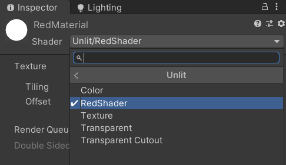
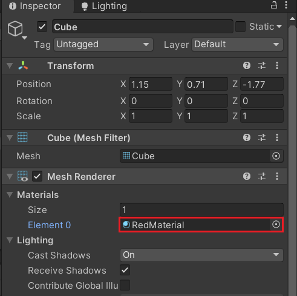

# Physically Based Shader Development for Unity 2017


* hlsl 从 Unity 2019.3 的 URP 开始启用（之前用的 Cg）
* 原书用的 Surface Shader，本文改写为 hlsl 版本


## Chapter 1 - How Shader Development Works


### Waht Is a Shader?

#### Shader Execution

* A rendered scene containing only a cube with colored vertices


* The scene's vertices and their respective data are passed to the `vertex shader`.
* A `vertex shader` is executed on each of them.
* The `vertex shader` produces an output data structure from each vertex.
  * Vertex contains information such as color and position of the vertex on the final image.
* Sequences of vertices are assembled into `primitives`, such as trianges, line, points, and others.
* The `rasterizer` takes a `primitive` and transforms it into a list of pixels.
  * For each potential pixel within that triangle, that structure's values are interpolated and passed to the `pixel shader`.
* The `fragment shader (pixel shader)` is run for any potential pixel.
  * Most lighting calculations happen here.
* If the renderer is a `forward render`, for every light after the first, the fragment shader will be run again, which that light's data.
* Each potential pixel (aka, fragment) is checked for whether there is another potential pixel nearer to the camera, therefore in front of the current pixel.
  * If there is, the fragment will be rejected.
* All the fragment shader light passes are blended together.
* All pixel colors are wirtten to a render target (could be the screen, or a texture, or a file, etc.)

#### Different Types of Shaders

* Vertex shader
* Fragment shader / Pixel shader
* Compute shader
  * computes arbitrary calculations, not necessarily rendering, e.g., physics simulation, image processing, raytracing
  * in general, any task that can be easily broken down into many independent tasks
* Unlit shader (Unity-only)
  * a shader that combines a vertex and pixel shader in one file
* Surface shader (Unity-only)
  * contains both vertex and fragment shader functionality
  * takes advantage of the ShaderLab extensions to the Cg shading language to automate some of the code that's commonly used in lighting shaders
* Image Effect shader (Unity-only)
  * used to apply effects like Blur, Bloom, Depth of Field, Color Grading, etc.
  * It is generally the last shader run on a renderer, because it's applied to a render of the geometry of the scene

#### Coordinate Systems

* Local (or Object) Space
  * The 3D coordinate system relative to the model being rendered
* World Space
  * The 3D coordiate system relative to the entire scene being rendered
* View (or Eye) Space
  * The 3D coordinate system relative to the viewer's point of view (the camera you're rendering from)
* Clip Space
  * A 3D coordinate system that has a range of -1.0 to 1.0
* Screen Space
  * The 2D coordinate system relative to the render target (the screen, etc.)
* Tangent Space
  * Used in Normal Mapping

#### Types of Light

* Point light
* Directional light
* Area light (only for baking lightmaps)


### The Rendering Equation


#### The Behavior of Light

TODO

#### Bounced Light

Bouched light will keep bouncing untli the energy is completely used up. That is what `GI (Global Illumination)` simulates.

* Direct light
  * The light that hits a surface directly.
* Indirect light
  * The light that hits the object after bouncing off from another surface.

Direct light only


Direct and indirect light


#### Renderer Types

* Forward
* Deferred
* Forward+ (Tiled Forward Shading)
* [URP (Universal Render Pipeline)][2]

#### Shader Visual Graphs

* Unity doesn't include one
* [ShaderForge][1], a 3rd-party implementation


## Chapter 2 - Your First Unity Shader

* 场景中，创建一个 Cube
* Assets中，创建一个 Material，命名为 "RedMaterial"
* Assets中，创建一个 Unlit Shader，命名为 "RedShader"
* 将 "RedMaterial" 的 shader 设置为 "RedShader"



* 将 "RedMaterial" 从 Assets 中拖入 Cube 上，赋给它
* 此时，Cube 是白色。Inspector面板 上可看到 Materials 设置为 "RedMaterial"



* 双击 "RedShader"，可以看到原始文件内容，如下
* 把 `_MainTex ("Texture", 2D) = "white" {}` 改为 `= "red" {}` 就变红了
* 太简单了，没啥好说的

```C
Shader "Unlit/RedShader"
{
    Properties
    {
        _MainTex ("Texture", 2D) = "white" {}
    }
    SubShader
    {
        Tags { "RenderType"="Opaque" }
        LOD 100

        Pass
        {
            CGPROGRAM
            #pragma vertex vert
            #pragma fragment frag
            // make fog work
            #pragma multi_compile_fog

            #include "UnityCG.cginc"

            struct appdata
            {
                float4 vertex : POSITION;
                float2 uv : TEXCOORD0;
            };

            struct v2f
            {
                float2 uv : TEXCOORD0;
                UNITY_FOG_COORDS(1)
                float4 vertex : SV_POSITION;
            };

            sampler2D _MainTex;
            float4 _MainTex_ST;

            v2f vert (appdata v)
            {
                v2f o;
                o.vertex = UnityObjectToClipPos(v.vertex);
                o.uv = TRANSFORM_TEX(v.uv, _MainTex);
                UNITY_TRANSFER_FOG(o,o.vertex);
                return o;
            }

            fixed4 frag (v2f i) : SV_Target
            {
                // sample the texture
                fixed4 col = tex2D(_MainTex, i.uv);
                // apply fog
                UNITY_APPLY_FOG(i.fogCoord, col);
                return col;
            }
            ENDCG
        }
    }
}
```

* CGPROGRAM/ENDCG - Cg Program

```C
CGPROGRAM
v2f vert (appdata v)
{
    v2f o;
    o.vertex = UnityObjectToClipPos(v.vertex);
    o.uv = TRANSFORM_TEX(v.uv, _MainTex);
    UNITY_TRANSFER_FOG(o,o.vertex);
    return o;
}

fixed4 frag (v2f i) : SV_Target
{
    // sample the texture
    fixed4 col = tex2D(_MainTex, i.uv);
    // apply fog
    UNITY_APPLY_FOG(i.fogCoord, col);
    return col;
}
ENDCG
```

* HLSLPROGRAM/ENDHLSL - 2019.3 可以用 hlsl

```C
HLSLPROGRAM
#pragma prefer_hlslcc gles
#pragma exclude_renderers d3d11_9x
#pragma target 3.5
#pragma multi_compile_fwdadd

#pragma shader_feature __ _NORMALMAP
#pragma shader_feature __ _ALPHATEST_ON

#define _TONE_MAPPING 1
#define BIOUM_ADDPASS

#pragma vertex ForwardAddVert
#pragma fragment ForwardAddFrag

#include "CharacterCommonPass.hlsl"
ENDHLSL
```


## Chapter 3 - The Graphics Pipeline

TODO


[1]:https://acegikmo.com/shaderforge/
[2]:https://docs.unity3d.com/Packages/com.unity.render-pipelines.universal@10.1/manual/index.html
