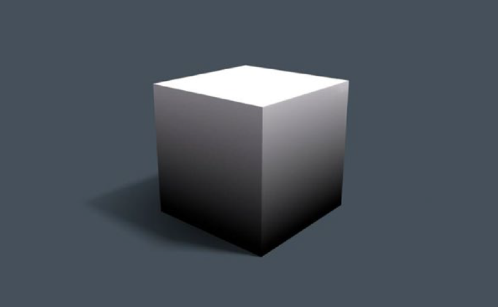
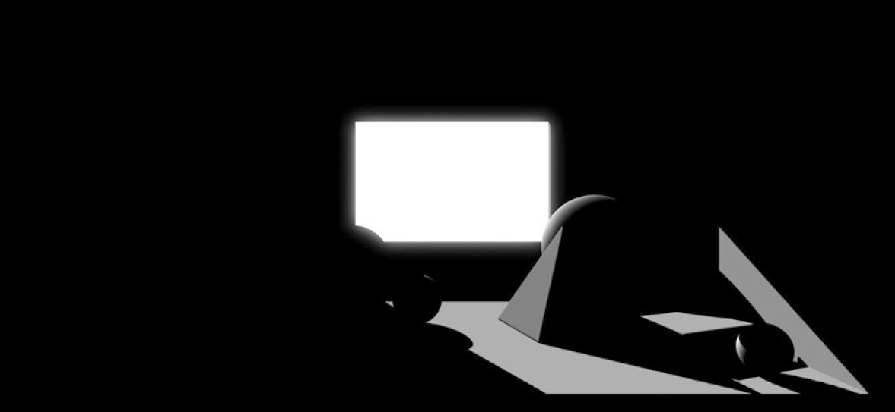
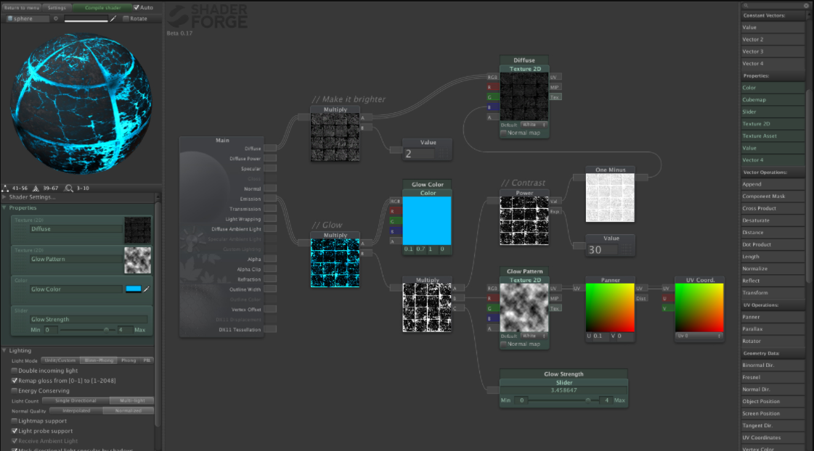

# Physically Based Shader Development for Unit 2017

* hlsl 从 unity 2019.3 的 URP 开始启用
* 之前用的 Cg

## Chapter 1 - How Shader Development Works

### Waht Is a Shader?

#### Shader Execution

* A rendered scene containing only a cube with colored vertices

* The scene's vertices and their respective data are passed to the `vertex shader`.
* A `vertex shader` is executed on each of them.
* The `vertex shader` produces an output data structure from each vertex.
  * Vertex contains information such as color and position of the vertex on the final image.
* Sequences of vertices are assembled into `primitives`, such as trianges, line, points, and others.
* The `rasterizer` takes a `primitive` and transforms it into a list of pixels.
  * For each potential pixel within that triangle, that structure's values are interpolated and passed to the `pixel shader`.
* The `fragment shader (pixel shader)` is run for any potential pixel.
  * Most lighting calculations happen here.
* If the renderer is a `forward render`, for every light after the first, the fragment shader will be run again, which that light's data.
* Each potential pixel (aka, fragment) is checked for whether there is another potential pixel nearer to the camera, therefore in front of the current pixel.
  * If there is, the fragment will be rejected.
* All the fragment shader light passes are blended together.
* All pixel colors are wirtten to a render target (could be the screen, or a texture, or a file, etc.)

#### Different Types of Shaders

* Vertex shader
* Fragment shader / Pixel shader
* Compute shader
  * computes arbitrary calculations, not necessarily rendering, e.g., physics simulation, image processing, raytracing
  * in general, any task that can be easily broken down into many independent tasks
* Unlit shader (Unity-only)
  * a shader that combines a vertex and pixel shader in one file
* Surface shader (Unity-only)
  * contains both vertex and fragment shader functionality
  * takes advantage of the ShaderLab extensions to the Cg shading language to automate some of the code that's commonly used in lighting shaders
* Image Effect shader (Unity-only)
  * used to apply effects like Blur, Bloom, Depth of Field, Color Grading, etc.
  * It is generally the last shader run on a renderer, because it's applied to a render of the geometry of the scene

#### Coordinate Systems

* Local (or Object) Space
  * The 3D coordinate system relative to the model being rendered
* World Space
  * The 3D coordiate system relative to the entire scene being rendered
* View (or Eye) Space
  * The 3D coordinate system relative to the viewer's point of view (the camera you're rendering from)
* Clip Space
  * A 3D coordinate system that has a range of -1.0 to 1.0
* Screen Space
  * The 2D coordinate system relative to the render target (the screen, etc.)
* Tangent Space
  * Used in Normal Mapping

#### Types of Light

* Point light
* Directional light
* Area light (only for baking lightmaps)

### The Rendering Equation

#### 

#### Bounced Light

Bouched light will keep bouncing untli the energy is completely used up. That is what `GI (Global Illumination)` simulates.

* Direct light
  * The light that hits a surface directly.
* Indirect light
  * The light that hits the object after bouncing off from another surface.

Direct light only

Direct and indirect light

#### Renderer Types

* Forward
* Deferred
* Forward+ (Tiled Forward Shading)
* [URP (Universal Render Pipeline)][2]

#### Shader Visual Graphs

* Unity doesn't include one
* [ShaderForge][1], a 3rd-party implementation

[1]:https://acegikmo.com/shaderforge/
[2]:https://docs.unity3d.com/Packages/com.unity.render-pipelines.universal@10.1/manual/index.html
