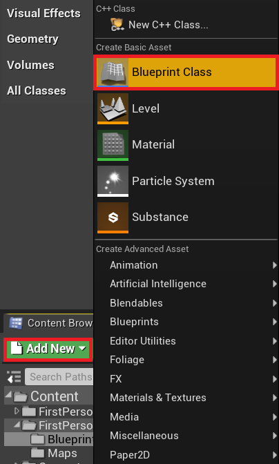
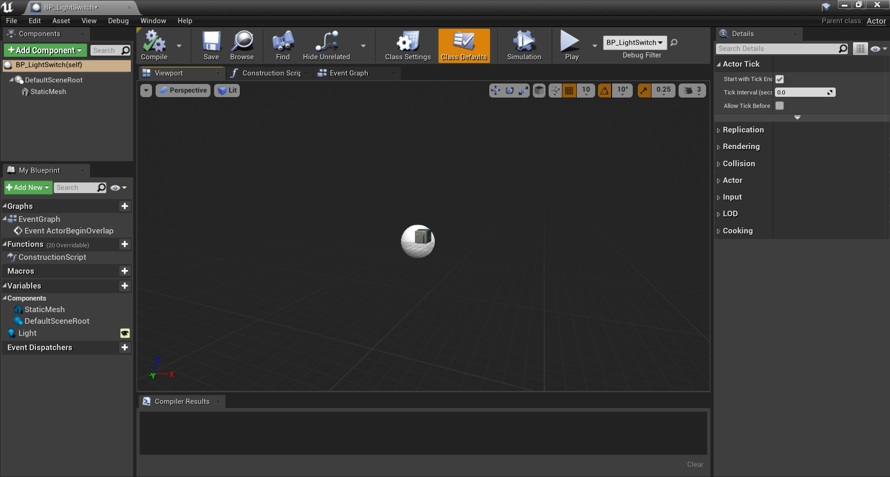
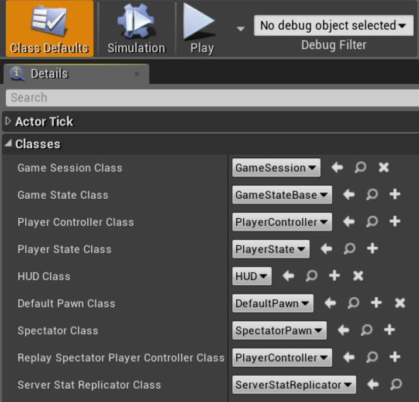
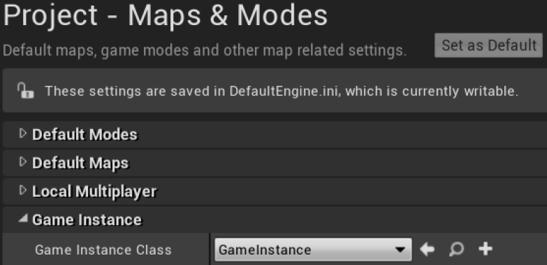

# Blueprints Visual Scripting for Unreal Engine

 * **Unreal Engine Version: 4.25**
 * 一个 Blueprint, 就是一个 C++ 的 class
 * 包含 Functions, Macros, Variables，完整映射 C++ class 中的各种类型


## Part I - Blueprint Fundamentals

### Level Blueprint

 * 和 Level 绑定的 Blueprint，可以控制 Level 加载时干点啥


 * Level Blueprint Editor
 * 和下面的 Blueprint Editor 略有不同（没有 Components/Viewport 和 Construction Script）


### Blueprint

 * 创建 Blueprint
 * 会让选择 Blueprint 的父类，常用的包括：Actor, Pawn, Character, Player Controller, Game Mode Base 等等



 * Blueprint Editor
 * Components, 此 Blueprint 附加的各种 Component，比如：CapsuleComponent(碰撞)、Mesh（模型显示）等等 
 * My Blueprint, 类定义，包括：Graphs, Functions, Variables 等等
 * Viewport, 看 Blueprint 长啥样
 * Construction Script, 构造函数，初始化 Blueprint instance
 * Event Graph, Blueprint 执行流程
 * Details, 选中某个 Fucntions, Variables，对应的属性面板
 * 注意：**改了 Blueprint 记得 Compile**



## Events & Actions

 * Events(红色)，某个条件下触发，引擎调用 Blueprint
 * Actions，具体行为，比如：SET, Print String
 * Variables 拖出来可以 Get 或 Set，比如下图的 Bot Name
 * Execution Path(白线)，逻辑执行流，执行到某一 Action，就做某个 Action 的行为


 * 上面的图，对应 C# 代码

```C#
class MyBlueprint
{
    public string BotName { get; set; }

    public void BeginPlay()
    {
        BotName = "Archon";
        Console.DebugPrint(BotName);
    }
}
```

 * 例子02


```C#
class MyBlueprint
{
    public bool HasShield { get; set; }
    public float ShieldValue { get; set; }

    public void BeginPlay()
    {
        ShieldValue = HasShield ? 100.0 : 0.0;
    }
}
```

 * 例子03


```C#
class MyBlueprint
{
    public float Willpower { get; set; }
    public float MagicPoints { get; set; }

    public void BeginPlay()
    {
        MagicPoints = Willpower * 20.0;
    }
}
```

### Variable Types

 * 基础类型：Boolean, Byte, Integer 等等
 * Structure
 * Interface
 * Object Types
 * Enum
 * 不同颜色对应不同类型（也许美术比较喜欢）
 * 类型和 C++ 中一一对应，不详细说了
 * 红框中表示：Single Variable、Array、Set、Map(Dictionary)


### Macros & Functions & Events

 * 三者异同


### Gameplay Framework Classes

 * 所有 OOP(Object-Oriented Programing) 的核心：搞懂所有类的继承关系
 * 哪个类负责啥功能，实现一个功能应该从哪里继承
 * Actor, 可以丢到场景中 tick 的 entity
 * ActorComponent, 组装到 Actor 上的功能模块
 * Pawn, 由 Controller 控制的 Actor，一般拿来做 NPC
 * Character, 继承 Pawn，自动组合了 CapsuleComponent、ArrowComponent、Mesh、CharacterMovement 等模块，一般拿来做主角
 * Controller，控制 Pawn
 * PlayerController，控制 Character
 * AIController，控制 Pawn，做 NPC AI
 * GameModeBase, 比较特殊，下面详述


#### Game Mode

 * GameMode，控制 Level 整体行为的总控类
 * 一个 Game 有多个 Level
 * 一个 Game 有一个 Default GameMode (Edit => Project Settings ... => Maps & Modes => Default GameMode)
 * 每个 Level 可以有独立的 GameMode (Settings => World Settings => Game Mode => GameMode Override)
 * GameModeBase, 要实现自己的 GameMode，继承它



#### Game Instance

 * class Game Instance, Level 之间跳转，用来做数据的序列化和传递
 * 有需要可以继承 Game Instance，实现一些特殊逻辑
 * 设置路径：Edit => Project Settings => Maps & Modes => Game Instance



### Direct Blueprint Communication

 * class 之间的函数调用

示例：创建一个开关，触碰，就切换一个 PointLight 的亮灭。（需要 StarterContent 资源）

 * 新建一个 Blueprint，继承 Actor，命名为 "BP_LightSwitch"
 * 双击打开 Blueprint Editor
 * 新增一个 **Static Mesh** 组件，用于显示一个模型（设置 StaticMesh = SM_CornerFrame；Collision Presents = OverlapAllDynamic）
 * 新增一个 **Variable**，类型为 Point Light，命名为 "Light"（设置 Instance Editable = True）
 * 构建 **Event Graph** 如下，利用函数 **Toggle Visibility** 去亮灭一个 Point Light
 * Compile Blueprint


```C#
class BP_LightSwitch
{
    public PointLight Light { get; set; }

    void ActorBeginOverlap(Actor otherActor)
    {
        if (Light != null)
        {
            Rendering.ToggleVisibility(Light.GetComponent<PointLightComponent>());
        }
    }
}
```

 * 回到 Level Editor
 * 场景中拖一个 Point Light，命名为 "Lamp"
 * 场景中拖一个 BP_LightSwitch，将 Light 变量赋值为 Lamp 对象
 * Play！哈，可以开关灯了

### Casting in Blueprints

 * 函数 **Cast To** 尝试将**基类对象**转换为**子类对象**（就是 C++ 中的 dynamic_cast）

示例：场景中散落一些物品，吃掉一个得50分

 * GameScore 保存在 GameMode 中
 * 触碰物品，调用 GameMode.AddGameScore() 函数，来增加分数

创建 BP_GameModeWithScore

 * 新建一个 Blueprint，继承 Game Mode Base，命名为 "BP_GameModeWithScore"
 * 双击打开 Blueprint Editor
 * 新增一个 **Variable**，类型为 Integer，命名为 "GameScore"
 * 新增一个 **function**，命名为 "AddGameScore"
 * 构建 **Event Graph** 如下，利用函数 **Toggle Visibility** 去亮灭一个 Point Light


 * 红框：函数 ToString(integer)
 * Compile BP_GameModeWithScore，Settings => World Settings => GameMode Override 设置 BP_GameModeWithScore

```C#
class BP_GameModeWithScore
{
    public int GameScore { get; set; }

    void AddGameScore(int Score)
    {
        GameScore += Score;
        Console.DebugPrint(GameScore.ToString());
    }
}
```

创建物品 BP_Collectable

 * 新建一个 Blueprint，继承 Actor，命名为 "BP_Collectable"
 * 双击打开 Blueprint Editor
 * 新增一个 **Static Mesh** 组件，用于显示一个模型（设置 StaticMesh = SM_Statue；Materials.Element0 = M_Metal_Gold；Collision Presents = OverlapAllDynamic）
 * 构建 **Event Graph** 如下


 * otherActor 是碰到物品的对象，通过 Cast To ThirdPersonCharacter，判断此对象是否是主角
 * 函数 GetGameMode() 得到 Current GameMode
 * 然后 Cast To BP_GameModeWithScore，得到 BP_GameModeWithScore 实例

```C#
class BP_Collectable
{
    void ActorBeginOverlap(Actor otherActor)
    {
        ThirdPersonCharacter aActor = otherActor as ThirdPersonCharacter
        if (aActor != null)
        {
            GameMode aGameMode = GetGameMode();
            BP_GameModeWithScore myGameMode = aGameMode as BP_GameModeWithScore;
            if (myGameMode != null)
            {
                myGameMode.AddGameScore(50);
                Utilities.DestroyActor(this);
            }
        }
    }
}
```

 * Compile BP_Collectable，场景中摆几个
 * Play！

### Level Blueprint Communication

 * Level Blueprint 可以控制 Level 中的 Object，并触发 Action

示例：走到一个位置，然后触发特效播放

 * 场景中摆放一个 Box Trigger，名字为 "Box Trigger 1"，保持选中状态
 * 打开 Level Blueprint Editor，在 Event Graph 中右键，给 "Box Trigger 1" 添加 Add On Actor Begin Overlap 事件
 * 回到 Level Editor，在场景中摆放一个 StartContent/Blueprints/Blueprint_Effect_Sparks，保持选中状态
 * 回到 Level Blueprint Editor，在 Event Graph 中邮件，选 "Create a Reference to Blueprint_Effect_Sparks"

## Part II - Developing a Game

