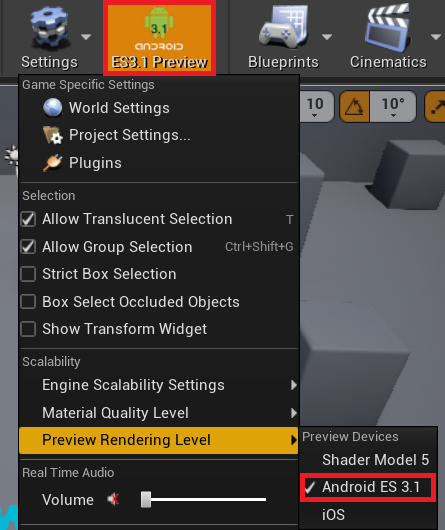
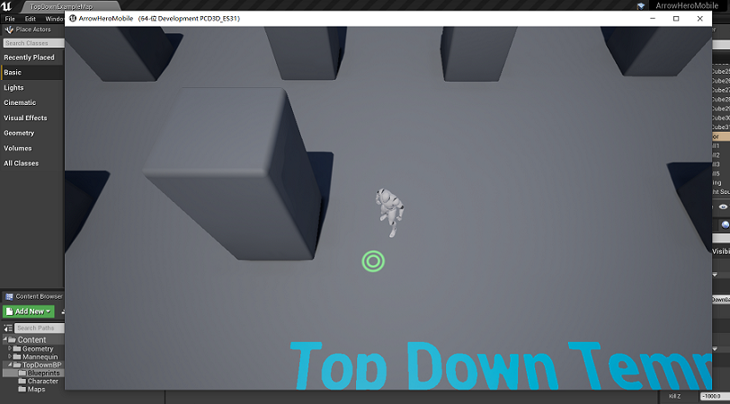

# UE4 Android Basics

 * **UnrealEngine Version: 4.25**
 * 支持 ES3.1 和 Vulkan


## OpenGL ES 3.1 Preview Mode

 * Settings => Preview Rendering Level => Android ES 3.1
 * 就可以看到 "ES3.2 Preview" 按钮，方便 PC 上预览效果



 * Play Settings => Modile Preview ES 3.1 (PIE)


 * 点 Play，启动独立窗口，并且使用 ES 3.1 Renderer




## Setup Development Environment

 * 官网有些教程是针对引擎早期版本的，本文只列出针对 4.25 的内容

安装 Android SDK & NDK

 * 4.25 推荐使用 Android Studio 来搭建环境（官方教程有很多 NVIDIA CodeWorks 相关内容，不适用于 4.25）
 * 并且仅支持 gradle 编译项目（不再支持 ant）
 * [Setting Up Android SDK and NDK for Unreal][1]，安装 Android Studio 3.5.3，以及对应的 NDK
 * [Setting Up Your Android Device For Development][2]，开启手机的 USB 调试

安装 Android Studio 的时候，如果改变了 Android SDK 的默认安装路径，可以通过设置 ANDROID_HOME 来通知 SetupAndroid.bat。

 * 我改变了默认 Android SDK 安装路径，SetupAndroid.bat 运行失败
 * 打开 SetupAndroid.bat 看看具体步骤，搞定！

```bat
> cd Engine/Extras/Android
> set ANDROID_HOME=D:\Android\Sdk
> SetupAndroid.bat
...
```

Android 机器要求

 * 最少支持 ES 3.1 + GL_EXT_texture_buffer + GL_EXT_color_buffer_half_float
 * 低配：Adreno 4xx
 * 高配：Adreno 6xx (支持 Vulkan)
 * [Android Device Compatibility][4]


## Launch on Device

设置 Android SDK & NDK & JavaHome

 * 这一步很坑，如果没设置，直接去做 [Android Quick Start][5] 中的 "Accept SDK License" 会一直不成功
 * Build apk 的时候，就老会提示 "SDK License must be accepted in the Android project settings to deploy your app to the device."
 * 翻 UE4 源码，终于让我把这个问题给解决了 :-)，参见附录1


设置 APK Packaging 信息

 * 点 "Condigure Now"
 * 点 "Accept SDK License"，成功的标志是按钮灰掉
 * 改 Package Name


参考资料

 * [Android Quick Start][5]，这里有所有基础步骤
 * 其中 "1 - Android Development Prerequisites" 针对 4.24 版本的，不需要看，其它内容可以看看


## Build APK

 * 最后这个就很简单了，选个发布目录，apk 就出来了


## 附录1 - "Accept SDK License" 的坑

 * 全局搜索 "SDK License must be accepted in the Android project settings to deploy your app to the device."
 * 发现在这里 **Engine\Source\Developer\Android\AndroidTargetPlatform\Private\AndroidTargetPlatform.cpp**

```C++
bool bEnableGradle;
GConfig->GetBool(TEXT("/Script/AndroidRuntimeSettings.AndroidRuntimeSettings"), TEXT("bEnableGradle"), bEnableGradle, GEngineIni);

if (bEnableGradle)
{
    // need to check license was accepted
    if (!HasLicense())
    {
        OutTutorialPath.Empty();
        CustomizedLogMessage = LOCTEXT("AndroidLicenseNotAcceptedMessageDetail", "SDK License must be accepted in the Android project settings to deploy your app to the device.");
        bReadyToBuild |= ETargetPlatformReadyStatus::LicenseNotAccepted;
    }
}
```

 * Editor 中没找到 bEnableGradle 的设置
 * 手工修改 **MyProject\Config\DefaultEngine.ini**，加上 "bEnableGradle=False"
 * Build APK 提示 "4.25 只支持 grandle 模式"

```ini
[/Script/AndroidRuntimeSettings.AndroidRuntimeSettings]
bDisableVerifyOBBOnStartUp=True
bEnableGradle=False
```

 * 注释掉 if (bEnableGradle) 的判断，编译 Editor

```C++
bool bEnableGradle;
GConfig->GetBool(TEXT("/Script/AndroidRuntimeSettings.AndroidRuntimeSettings"), TEXT("bEnableGradle"), bEnableGradle, GEngineIni);

#if 0
if (bEnableGradle)
{
    ...
}
#endif
```

 * 可以 build apk，但 Log 最后会提示 license 未 accept （有个 C# 程序会检查）
 * 同时 Log 还提示找不到 ANDROID_HOME，恍然大悟，去 Project Settings => Android SDK 做好设置，搞定


## 其它

 * [Android Debugging][6]，用 Android Studio 调试 C++/Java 代码


[1]:https://docs.unrealengine.com/en-US/Platforms/Mobile/Android/Setup/AndroidStudio/index.html
[2]:https://docs.unrealengine.com/en-US/Platforms/Mobile/Android/SettingAndroidDeviceDevelopment/index.html
[3]:https://docs.unrealengine.com/en-US/Platforms/Mobile/Android/index.html
[4]:https://docs.unrealengine.com/en-US/Platforms/Mobile/Android/DeviceCompatibility/index.html
[5]:https://docs.unrealengine.com/en-US/Platforms/Mobile/Android/GettingStarted/index.html
[6]:https://docs.unrealengine.com/en-US/Platforms/Mobile/Android/AndroidDebugging/index.html
