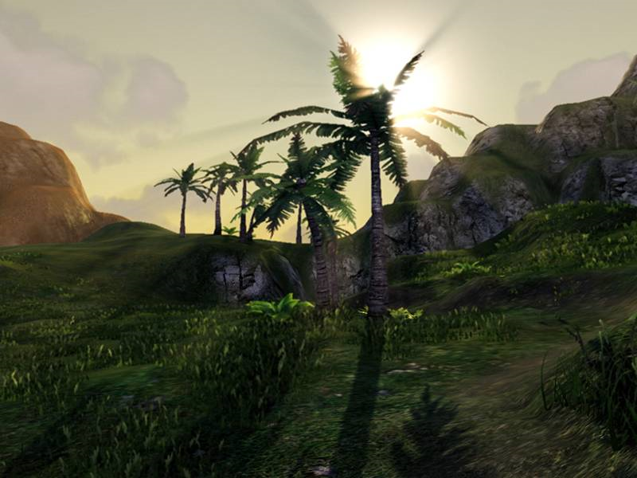
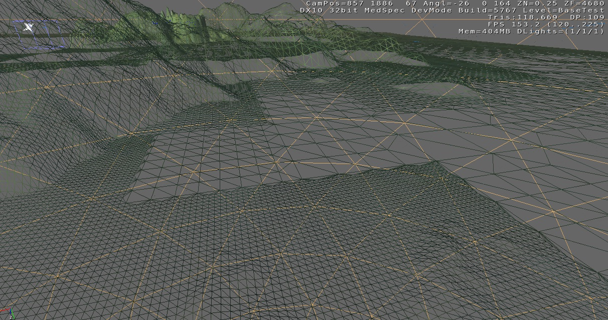

# CryENGINE2 渲染引擎剖析（转）

转自：[https://www.cnblogs.com/Zephyroal/archive/2010/10/16/1852884.html][1]

## 前言

这个帖可能在这儿发比较奇怪，不过我是一个信仰黑客精神的程序员，也非常支持 [KlayGE][2] 的研发，希望发一些我的原创资料，和作者，以及 [KlayGE][2] 的作用者交流，甚至有一些麻烦的问题，也希望作者可以解答，如果 [KlayGE][2] 的研发能够涉及到这些东西，那就最好了。

作为一个刚从业不久的引擎开发人员，为了能快速有效地提高自己引擎的渲染质量，使用了各种办法来解析 CryENGINE 的渲染手法。在此我将以专业的视角来与您分享我的经验和成果。如果您也是专业的图形程序员，希望与您一起讨论，解读这款令人惊叹的引擎，如果您是一个刚刚入门的新人或者爱好者，这将成为您不可多得的原创中文资料。

CryENGINE 是目前最难窥探的引擎没有之一，比起在中国泛滥的 UnrealEngine3 和 [Gamebryo][4] 的源代码，CryENGINE 也显得神秘得多，很少有人说自己有这款引擎，哪怕只有一个Eval。虽然有教育免费版，但是据我所知，也只有北大才申请到了授权。花了500W左右买了授权的好像也只有畅游和久游。但是越是如此，这款引擎的魅力越让人无法抗拒。当我有 [PerfHUD][3]、PIX 这样的分析工具时，我如何能不想着去拆解这个神秘又神奇的引擎呢。

Crysis 所伴随的往往是最高画质的赞美和硬件杀手的批评，但是，我觉得即使这样，CryENGINE 仍然可以称为当今世界上优化最好，负载最大的引擎。其实引擎的设计追求的主要是负载能力，追求画面的应该是游戏。但是反过来，拥有最大的画面质量，没有引擎的强大负载，肯定是做不到的。任何引擎可以被美术用成硬件杀手，但是能在同样的情况下，跑出 Crysis 那样的画面的引擎肯定有着强大的负载能力。

CryENGINE 优化的出彩之处主要有以下几个方面：

 * 材质排序：从 [PerfHUD][3] 的结果来看，CryENGINE 对 DXAPI 的调用是最为简洁的，如此多的材质，却只有如此简洁的状态切换过程，不能不令人赞叹，相比之下，[Ogre][5] 或者 [Gamebryo][4] 之类的三流引擎做得就要差得多。材质排序已经被做到了极至，从这里省下来的时间，成为了Crysis如此复杂的宏大场景的基础。

 * 技术选择：这是我最佩服Crytek的一点，如此多的次世代渲染技术，竟然每个都如此地和谐，兼顾着性能与效果。我研究了它的好多渲染手法，真是深有感触，为啥能如此恰当地选择技术呢？后来看了它们 LPV 的一篇 Paper 中有这样一个预算（下图）。这从恍然大悟。原来他们竟如此专业，预先做了这样的评估，难怪技术都被优化得如此高效，和谐。

 * 瑕疵优化：这个通常被人忽略，或者被人认为是错的。很多人都觉得宁愿速度慢一点，也要求技术没有瑕疵。其实，这是不对的。瑕不掩瑜，在 Crysis 如此震撼的效果面前，有几个会对它技术的瑕疵非常关注，觉得不能忍受呢？但是在 CryENGINE 中，所有的瑕疵都换来了宝贵的时间，以至它能对一个游戏添加如此多的渲染技术，以达到 Crysis 的效果。

有了这些与众不同，使 CryENGINE 变得如此另类，以及怪物般的负载能力。当然有人要说，CryENGINE 不是最快的，因为相同速度的情况下，虚幻的画面可能更好。对，确实，虚幻的 Irradiance 技术提供了一个廉价的 GI 效果，但是，这个东西带来的限制却让虚幻完全没有能力大幅度改变场景光照，因为主光源是预先渲染好的。这个东西在 CryENGINE3 中已经被支持了，同时候还有了 LPV 这个神奇的动态 GI。这样说的话，Crysis 所追求的全动态场景的理念其实也是逼真临场体验的一部分，当然需要更多的性能开销了。也就是因为 Crysis 有昼夜变化，才带来了这种前所未有的临场体验。

接下来，我要对 Crysis 所使用的渲染技术进行一些细致的剖析，当然也带着一些不理解的问题，希望大牛们能给我一些建议和帮助。

Crysis 是用 CryENGINE2 制作的，CryENGINE3 无幸窥见，在这里，先说说确切的 CryENGINE2 的渲染过程。

众所周知 CryENGINE2，没有使用 DeferredShading，所以无法支持太多的光源，主要渲染围绕着阳光进行，而且使用了非常复杂的 PixelShader 来实现漂亮的材质，所以 ZPass 预渲染就变得很必要，不然会有很多无用像素被复杂的 PixelShader 渲染，当然这个和 DeferredShading 一样，无法支持 Blend，所以只有两种，普通和 AlphaTest。渲染 ZPass 为了开启 PreZ，肯定要进行排序，先渲染普通物体，后渲染带 AlphaTest（当然是使用 Shader 的 Texkill 来进行，没有状态切换）的物体。其实标准的 ZPass 应该是不需要 ColorWrite 的，但是 Crysis 利用这个机会，输出了深度到一张 R32F，因为视距为八公里，乘一个 0.000125 映射到 [0,1]，天空为2。有了深度的 G-Buffer，其实就已经可以做很多事了，除了光照外很多的后处理都可以用这张深度缓冲来进行。有了深度后，会先进行 AO 计算，然后阴影，这都是屏幕空间的计算，然后渲染每个物体都会对这两张图进行采样。AO 是一张 RGBA，R通道用来存 SSAO 的结果，G通道用来存 2.5D TerrainAO 的结果。然后进行一次 Blur。阴影是有个 Mask 的，平行光一般是R，剩下三个通道，大概可以存放三个点光源或者 SpotLight 吧。然后就是对一张 R16G16B16A16F 进行 HDR 的高范围渲染。这回 DepthFunc 已经是 Equal 了，因为深度已经完全填充。当然，为了 PreZ，还是先普通后 AlphaTest，然后会看到大量的碎片，因为Z检测会挡掉大量像素。所有着色像素加起来也几乎就是屏幕像素了，除非有两个三角形有点是同 Depth 的 Fighting 状态，当然可能性很低。完成后会进行 Blend 渲染，主要是粒子，玻璃之类的东西。结束后，就要进行 HDR ToneMap 和 HDR HighLightBloom 了。完成后，接下来有一个 EdgeAA，当然除此之外应该还有抗齿过程，只是调试时肯定是要关掉的。EdgeAA 是个抗齿的后处理，只使用 Depth 来提取边缘。然后还有个 Glow，大概会把火焰之类的 Bloom 加大吧。在这之后，就是 SunShaft，来加上漂亮的 Ray 和 Beam，最后会进行 ColorGrading，完成渲染的最后一步，这样，就能看到 Crysis 的画面了。这样说是不是有些笼统呢？没关系，如果大家喜欢，我还会继续深入剖析 CryENGINE 渲染的一些技术点，来解读震撼画面背后的故事。今天有点晚了先写到这儿了。

睡前再写一些看了 [KlayGE][2] 后的感想，[KlayGE][2] 是一款我很喜欢的开源引擎。对于开源引擎来说，没有强大的资金支持，很难开发出像商业引擎那样功能强大的实用引擎。[KlayGE][2] 这样研究一些新鲜的 API，支持 OGL3或4，DX11，以及一些好玩的技术的实现，却是真正有帮助的。它的字体算法的设计真的是非常的独到，让我非常震撼，我正在想有什么办法能使缩小时更清晰。像 [Ogre][5]、[Irrlicht][6] 那种引擎中既见不到强大的实用性，又没有这样的看点，我个人还是比较无爱的。[KlayGE][2] 最近又出了 FFT 的水，对于只能看到 SigGraph1999 的我来说，还是非常有帮助的，记得上回 [Ogre][5] 有个水体插件，也做了 FFT 的波动，不过实时 CPU 刷顶点做法还是有点过了，这了新的 Demo 看，真的挺兴奋的。

有一点想问下作者，你的 DeferredShading 为啥不支持 HW 的 AA 呢，而使用一个后处理来进行？DX10开始，MRT 不是已经可以 AA 了吗？难道还有什么障碍？

最后发张我现在自己渲染的图，虽然比 Crysis 差不少，但是渲染技术是差不多的。其实如果时间允许，我真是想自己操刀写个引擎，把 [Ogre][5] 改成这样真不是一般的麻烦，[Ogre][5] 的渲染体系太古典了，不太适应现代的技术，搞得我动不动接管过来调 DX，不然要么性能莫名其妙地不见，要么就是干脆无法实现。不过因为 DX9，使用了 DeferredShading 后只能用后处理来抗齿，其实可以用超级采样，但是舍不得那性能啊。[Ogre][5] 的材质系统不灵活，导致我一怒之下统一使用了线性过滤，材质糊糊的很不爽。下一步，可能就是要尝试下 LPV 了，毕竟 GI 还是很令人 Happy 的。

## Terrain

首先谈谈 CryENGINE 的地形技术。地形技术是 CryENGINE 的一个较为核心的技术，为了实现八公里的超远视距，地形经过了比较细致的优化。CryENGINE 的地形主要使用的数据结构仍然是高度图，并且在 CryENGINE2 中可以看到，它所支持的尺寸非常有限，好像也不是动态加载技术的无缝大场景。为此为特地下了 Crysis 的 Sandbox 一探究竟。CryENGINE 的地形 LOD 时并没有 Morph 的过渡而是直接突变，这让我很惊呀，一般地，地形 LOD 时的突变会非常刺眼以至于让人难以接受，但是在 Crysis 中，我却完全无法意识到这一点，反复摆弄它的场景后发现，原来是超高密度的植被覆盖使得地形的跳动完全被植被所遮挡，植被同样也在不停地突变，所以一般只能感觉到植被 LOD 时的突变，而无法感觉到地形 LOD 时的突变。因为不需要 Morph，CryENGINE 地形的灵活性就体现出来了，它可以切到最小只有 2M*2M 一个单元，但是越远，绘制的实际单元还是有所合并，具体 LOD 的细节仍然没有完全搞清楚，如果哪位大牛知道，希望能够不吝地告诉我，不胜感激啊。但是有一点是很清楚，它的 LOD 是有根据视觉复杂度和距离两个标准来决定网格精度的，我贴一张 Wireframe 先：

可以看到，网格精度并不是均匀地由近到远递减的，而是以地块视觉复杂度为权值的递减，期间有相当多的补面，以保证没有T型接缝。不过由于不需要 Morph，跨级 LOD 之间的补面变得相对容易。

除了 LOD 外，地表材质也是 CryENGINE 的一个比较出众的特性，Crysis 的地表材质细节之丰富，绝对是目前绝无仅有的，但是支持它使用如此多材质的地表细节技术，却是 CryENGINE 的一个特殊做法带来的。CryENGINE 并没有使用什么四层混合，而是按单层来划分的。当一层材质被刷到地形上的时候，CryENGINE 会生成一个材质的覆盖范围，也就是说每一个材质绘制时都有独立的IB区段，这样最大的好处是每个层都可以使用独立的渲染技术，而不会影响其它层，比如有 parallax 的地形层只有很少的一两个，但是混在其它层中却让地形细节有了整体的提升。还有就是因为地形距离有八公里，所以不可能都使用 Blend 的 Tiling 的v从x细节，在细节的几百米范围之外，就切换成只有一张的预生成大纹理，VirtualTexture技术在这里得到了应用。在同时使用了Tiling和VirtualTexture的情况下，Cryengine的地形远近都有很好的细节表现，同时性能上也能够支撑起八公里的视距。

当然Cryengine的地形技术中还有个神奇的Voxel技术。Voxel其实是个很古老的概念，应用到地形中应该是三角洲的时候。不过那时的Voxel技术不是很适应现在的图形管线，Cryengine只是使用了那Voxel作为一部分特殊地形的数据存储，最后用了某种算法，生成了与高度图Terrain无缝连接的Mesh，使得悬崖，山洞可以在引擎中用Terrain实现。通常要做这些往往都使用模型，而不同的系统使用起来很容易产生接缝。这就是Crysis地貌如此丰富的原因。

不过Voxel的生成算法，我还没有想到，或者看到，很想知道有什么好办法来实现这个。不知道龚敏敏大大是否有这方面的办法，或者有见过关于这个的文献。如果KlayGE能整合一个类似的算法，那就最好了

[1]:https://www.cnblogs.com/Zephyroal/archive/2010/10/16/1852884.html
[2]:http://www.klayge.org/
[3]:https://developer.nvidia.com/nvidia-perfhud
[4]:http://www.gamebryo.com/
[5]:https://www.ogre3d.org/
[6]:http://irrlicht.sourceforge.net/
