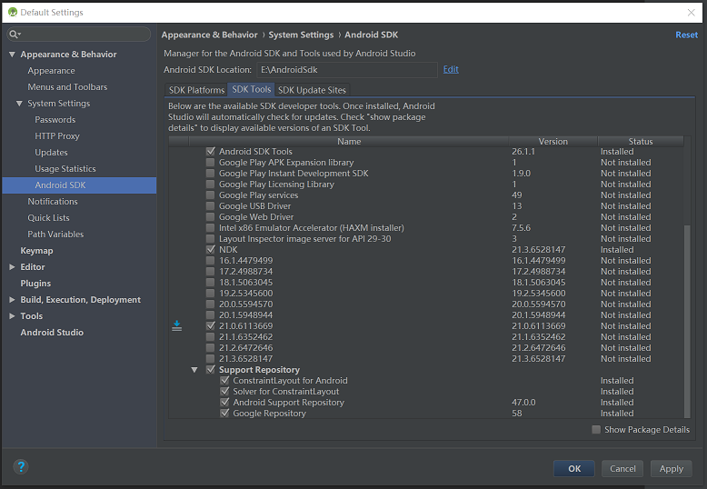

# Emake dance with Android-NDK

## NDK 的安装

通过 Android Studio 的 SDK Manager，统一安装。（AndroidSdk 路径可以自己修改）




## 配置 cmdline 环境

 * 假设 Android Studio 安装在："C:\Program Files\Android\Android Studio"
 * 假设 Android SDK 路径在："E:\AndroidSdk"
 * 配置一个 setup_build_env.cmd，可以方便调用 java & gradle

```
@echo off

set ANDROID_STUDIO_HOME="C:\Program Files\Android\Android Studio"
set JAVA_HOME=%ANDROID_STUDIO_HOME%\jre
set GRADLE_HOME=%ANDROID_STUDIO_HOME%\gradle\gradle-4.4
set PATH=%PATH%;%JAVA_HOME%\bin;%GRADLE_HOME%\bin
```


## Play with NDK samples

 * [https://github.com/android/ndk-samples][3]

### 关于 NDK (side by side)

 * SDK Manager 中可以选择安装不同版本的 NDK
 * 最新版的 NDK 在：AndroidSdk\ndk-bundle
 * 老版本的 NDK (side by side)，在：AndroidSdk\ndk\<version>

需要手工修改 local.properties，选择正确的 NDK 目录。比如：

```
ndk.dir=E\:\\AndroidSdk\\ndk\\21.2.6472646
sdk.dir=E\:\\AndroidSdk
```

### 编译

```
cd project_dir
gradlew.bat assembleDebug
```

## Gradle

 * [emake][1]
 * [Android-NDK][2]

[1]:https://github.com/skywind3000/emake
[2]:https://developer.android.com/ndk
[3]:https://github.com/android/ndk-samples
